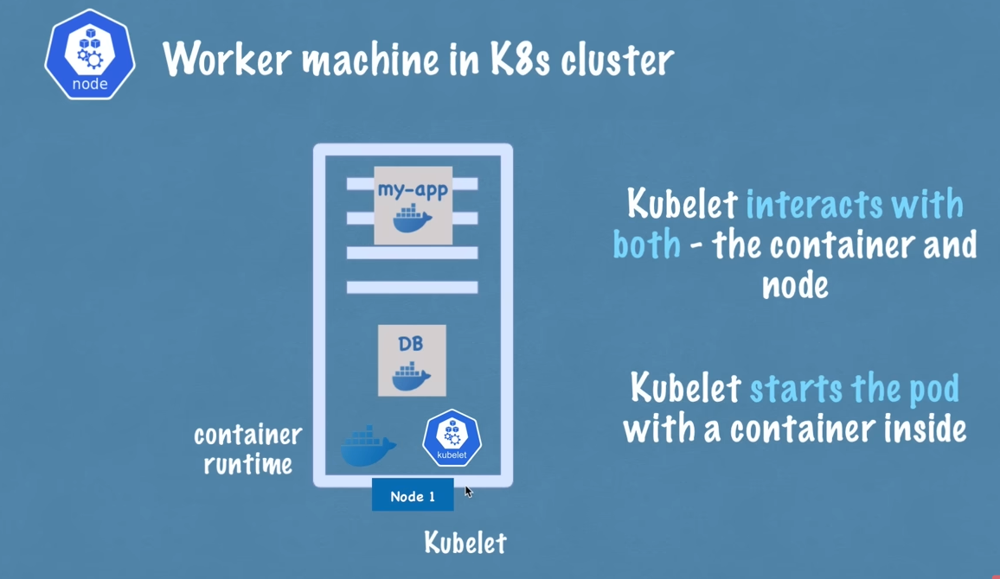
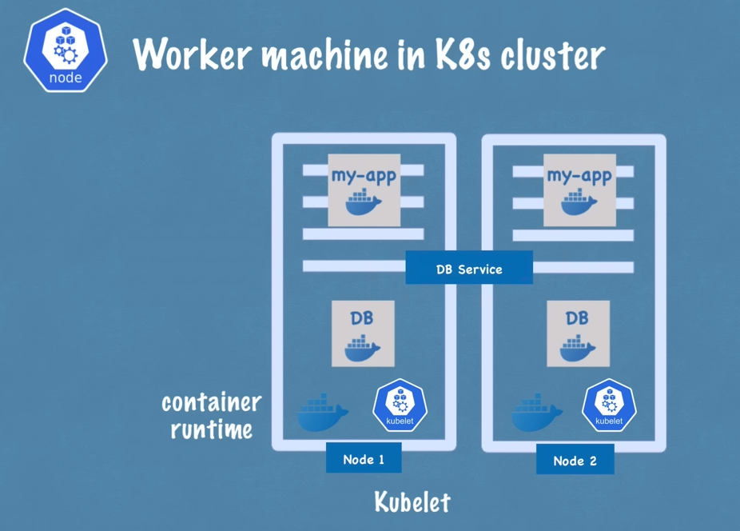
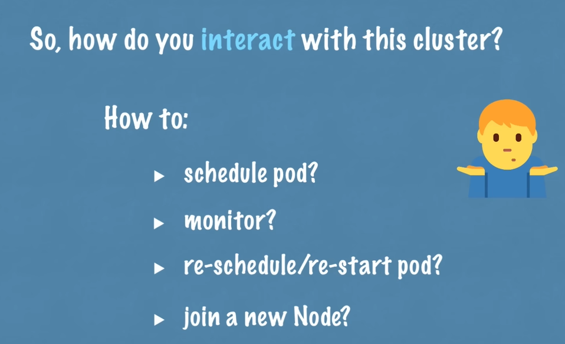
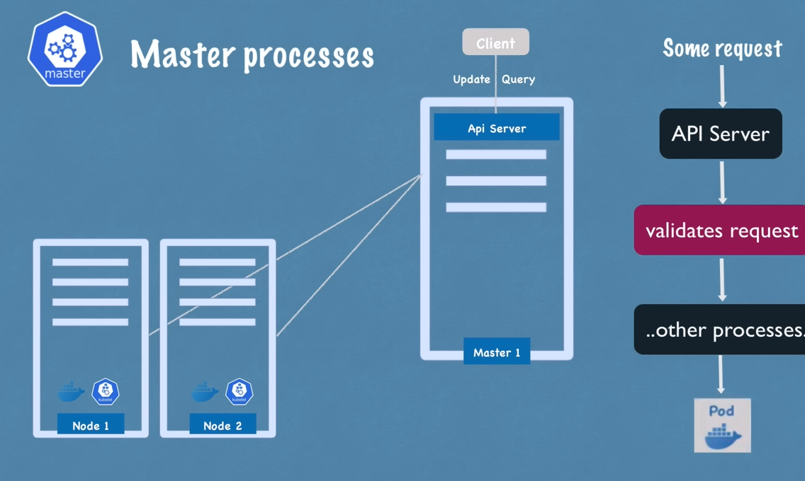
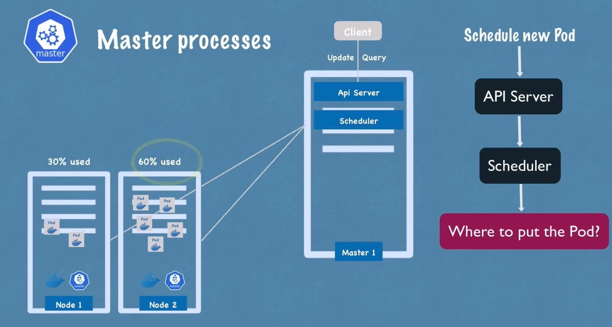
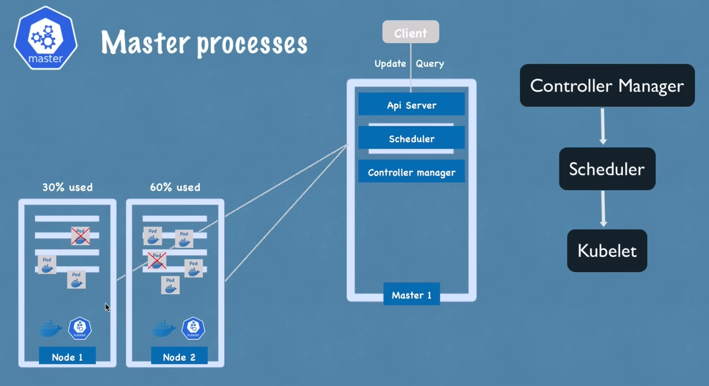
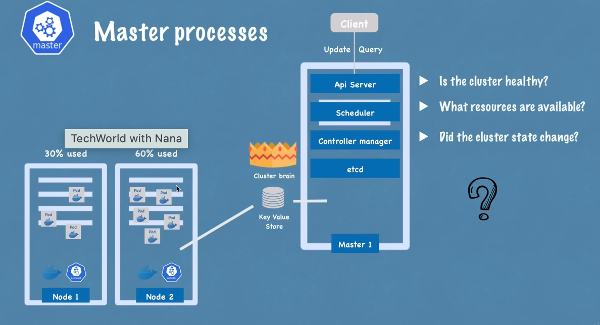
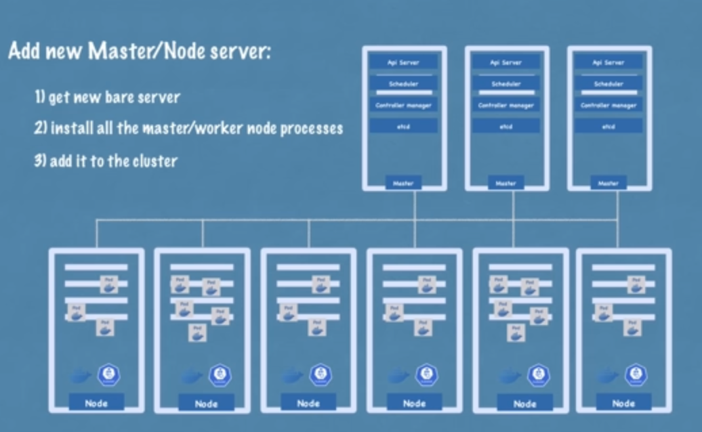

Worker Nodes
Node Processes
- One of the main components of kubernetes architecture are its worker servers or nodes and each node will have multiple application pods with containers running on that node
- The way kubernetes does it is using three processes that must be installed on every node that are used to schedule and manage those parts so nodes are the cluster servers that actually do the work that's why sometimes also called worker nodes
1. Container runtime

- First process that needs to run on every node is the container runtime because application pods have containers running inside, container runtime needs to be installed on every node 

2. Kubelet
- But the process that actually schedules those pods and the containers in underneath is kubelet
- Which is a process of kubernetes itself unlike container runtime that has interface with both container runtime and the Machine / node
- Kubelet is responsible for taking that configuration and actually running a pod or starting a pod with a container inside and then assigning resources from that node to The Container like CPU RAM and storage resources so usually kubernetes cluster is made up of multiple nodes which also must have container runtime and cubelet services installed and we can have hundreds of those worker nodes which will run other pods and containers and replicas of the existing parts like our app and database pods in this example and the way that communication between them works is using Services which is sort of a load balancer that basically catch matches the request directed to the part or the application like database for example and then forwards it to the respective part

3. Kube proxy
- The third process that is responsible for forwarding requests from services to pods is actually Kube proxy that also must be installed on every node and Kube proxy has actually intelligent forwarding logic inside that makes sure that the communication also works in a performant way with low overhead for example if an application my app replica is making a requested database instead of service just randomly forwarding the request to any replica it will actually forward it to the replica that is running on the same node as the Pod that initiated the request thus this way avoiding the network overhead of sending the request to another machine

-  Two kubernetes processes cubelet and Cube proxy must be installed on every kubernetes worker node along with an independent container runtime in order for kubernetes cluster to function properly 

Master Nodes
Master Processes

- All these managing processes are done by Master nodes 

- There are four processes that run on every masternode that control the cluster State and the worker nodes as
1. API server
- First service is API server so when we as a user want to deploy a new application in a kubernetes cluster we interact with the API server using some client it could be a UI like kubernetes dashboard could be command line tool like cubelet or a kubernetes API
- API server is like a cluster Gateway which gets the initial request of any updates into the cluster or even the queries from the cluster and it also acts as a gatekeeper for authentication to make sure that only authenticated and authorized requests get through to the cluster
- Whenever we want to schedule new pods, deploy new applications, create new service, any other components we have to talk to the API server on the master node and the API server then validate wer request and if everything is fine then it will forward wer request to other processes in order to schedule the Pod or create this component that we requested
-  If we want to query the status of wer deployment or the cluster Health Etc we make a request to the API server and it gives we the response
- which is good for security because we just have one entry point into the cluster

2. Scheduler
- Another Master process is a scheduler so as we mentioned if we send an API server a request to schedule a new pod API server after it validates wer request will actually hand it over to the scheduler in order to start that application pod on one of the worker nodes and of course instead of just randomly assigning to any node schedule has this whole intelligent way of deciding on which specific worker node the next pod will be scheduled or next component will be scheduled
- First it will look at wer request and see how much resources the application that we want to schedule will need how much CPU how much RAM then it it's going to look at and it's going to go through the worker nodes and see the available resources on each one of them and if it says that one node is the least busy or has the most resources available it will schedule the new part on that node
- Scheduler just decides on which nodes a new pod will be scheduled the process that actually does the scheduling that actually starts that pod with a container is the cubelet so it gets the request from the scheduler and executes the request on that node

3. Controller Manager
- Next component is controller manager which is another crucial component because what happens when pods die on any node there must be a way to detect that the nodes died and then reschedule those pods as soon as possible
- controller manager does is it detects the State changes like crashing of pods for example so when pods die controller manager detects that and tries to recover the cluster State as soon as possible and for that it makes a request to the scheduler to reschedule those dead pods in the same cycle happens here where the scheduler decides based on the resource calculation which worker nodes should restart those pods again and makes requests to the corresponding kubelets on those worker nodes to actually restart the pods 

4. Etcd
- Etcd which is a key Value Store of a cluster State
- Think of it as a cluster brain actually which means that every change in the cluster for example when a new pod gets scheduled when a pod dies all of these changes get saved or updated into this key Value Store of etcd
-  The reason why atcd store is a cluster brain is because all of this mechanism with scheduler controller manager Etc works because of its data
-  So for example how does scheduler know what resources are available on on each worker node or how does controller manager know that a cluster stay changed in some way for example pods diet or that cubelet restarted new pods upon the request of a scheduler or when we make a query request to API server about the cluster health or for example wer application deployment state where does API server get all this state information from all of this information is stored in etcd cluster
- What is not stored in the etcd key value store is the actual application data for example if we have a database application running inside of a cluster the data will be stored somewhere else not in the etcd 
- This is just a cluster State information which is used for master processes to communicate with the work processes and vice versa

- In practice kubernetes cluster is usually made up of multiple Masters where each Master node runs its Master processes where of course the API server is load balanced and the it's etcd store forms a distributed storage across all the master nodes

Example cluster setup

- Realistic example of a cluster setup so in a very small cluster we would probably have two masternodes and three worker nodes
- Hardware resources of Master and nodes servers actually differ the master processes are more important but they actually have less load of work so they need less resources like CPU RAM and storage whereas the worker nodes do the actual job of running those pods with containers inside therefore they need more resources and as wer application complexity and its demand of resources increases
- We may actually add more master and node servers to our cluster and thus forming a more powerful and robust cluster to meet our application resource requirements
- In an existing kubernetes cluster we can actually add new master or node servers pretty easily so if we want to add a master server
    - just get a new bare server we install all the master processes on it and add it to the kubernetes cluster
    - same way if we need two worker nodes we get pair servers we install all the worker node processes like container runtime cubelet and Q proxy on it and add it to the kubernetes cluster that's it and this way we can infinitely increase the power and resources of our kubernetes cluster

