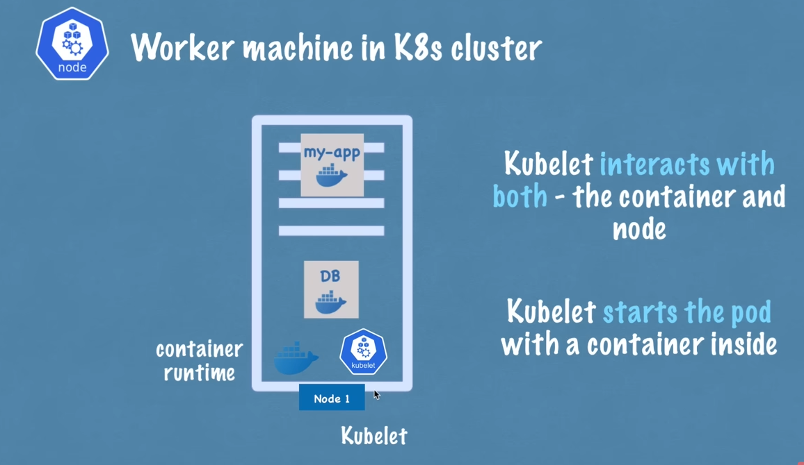
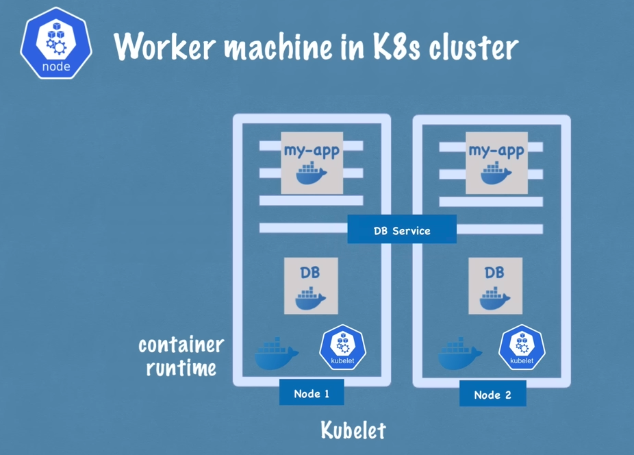
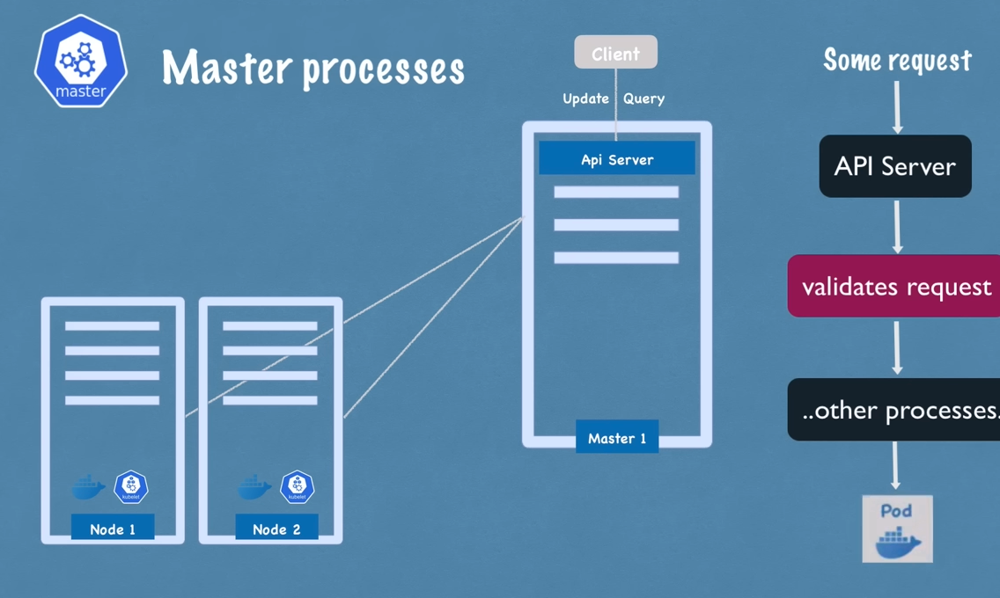
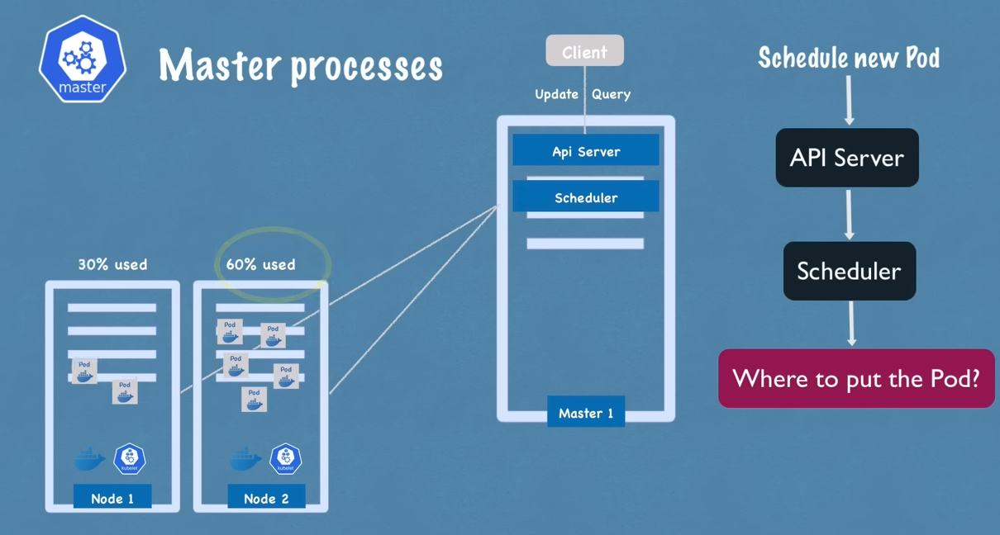

# Kubernetes Node Architecture

## Worker Nodes (Worker Servers)
**Core Function:** Host application pods with containers

### Node Processes (Must be installed on every worker node)
1. **Container Runtime**  
   - Required to run containers inside pods
   - Examples: containerd, CRI-O, Docker Engine

2. **Kubelet**  
   - Kubernetes node agent
   - Responsibilities:
     - Pod scheduling & lifecycle management
     - Resource allocation (CPU/RAM/storage)
     - Communication with control plane

3. **Kube Proxy**  
   - Network management component
   - Key functions:
     - Maintains network rules
     - Implements Service abstraction
     - Intelligent request forwarding:
       - Prefers same-node pod communication
       - Load balancing between pods

## Master Nodes (Control Plane)
**Core Function:** Manage cluster state and worker nodes

### Master Processes
1. **API Server**  
   - Cluster gateway & single entry point
   - Features:
     - REST API interface
     - Authentication/authorization
     - State validation
     - Client interactions (kubectl/UI/API)

2. **Scheduler**  
   - Resource optimization engine
   - Scheduling logic:
     - Analyzes pod resource requirements
     - Evaluates node capacity
     - Selects optimal worker node
   - Works with kubelet for pod execution

3. **Controller Manager**  
   - Cluster state maintenance
   - Key responsibilities:
     - Node monitoring
     - Pod recovery
     - Replication management
     - Endpoint synchronization

4. **etcd**  
   - Distributed key-value store
   - Stores:
     - Cluster configuration
     - State information
     - Metadata
   - Does NOT store application data
   - Forms cluster "brain" for state management

## Cluster Setup & Scaling
### Typical Production Setup
- **Multi-master configuration**:
  - 2+ master nodes for HA
  - Load-balanced API servers
  - Distributed etcd cluster
- **Worker node scaling**:
  - 3+ worker nodes minimum
  - Auto-scaling groups common in cloud

### Node Characteristics
|                | Master Nodes               | Worker Nodes               |
|----------------|----------------------------|----------------------------|
| **Resources**  | Moderate CPU/RAM           | High CPU/RAM/Storage       |
| **Workload**   | Control plane processes    | Application pods           |
| **Scalability**| Add for HA                 | Add for capacity           |

### Scaling Operations
1. **Adding Master Nodes**:
   - Install control plane processes
   - Join to existing etcd cluster
   - Configure API server load balancing

2. **Adding Worker Nodes**:
   - Install node processes (CRI, kubelet, kube-proxy)
   - Join to cluster via kubeadm/kubelet

> **Best Practice:** Use infrastructure-as-code (IaC) tools like Terraform for node provisioning and scaling operations.