Pod
- smallest unit of K8s
- Abstraction over container
- usually 1 application per Pod 
- pod is usually meant to run one 
- application container inside of it we can run multiple containers inside one pod but usually it's only the case if we have one main application container and a helper container or some side service that has to run inside of that pod
- Each pod gets its own IP address
- An application pod which is our own application and will use a database pod with its own container

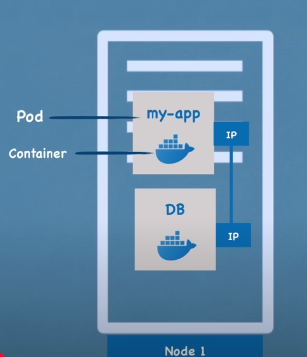

- If I lose a database container because the container crashed because the application crashed inside or because the nodes the server that I'm running them on ran out resources the Pod will die and a new one will get created in its place and when that happens it will get assigned a new IP address which obviously is inconvenient if we are communicating with the database using the IP address because now we have to adjust it every time pod restarts and because of that another component of kubernetes called service is used.

Service
- service is basically a static IP address or permanent IP address that can be attached so to say to each pod
- app will have its own service and database pod will have its own service
- good thing here is that the life cycles of service and the Pod are not connected so even if the Pod dies the service and its IP address will stay so we don't have to change that endpoint

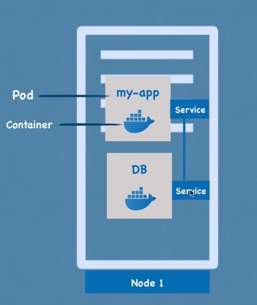

-  We would want our application to be accessible through a browser right and for this we would have to create an external service
- External services is a service that opens the communication from external sources but obviously we wouldn't want our database to be open to the public requests and for that we would create something called an internal service

- this is a type of a service that we specify when creating one

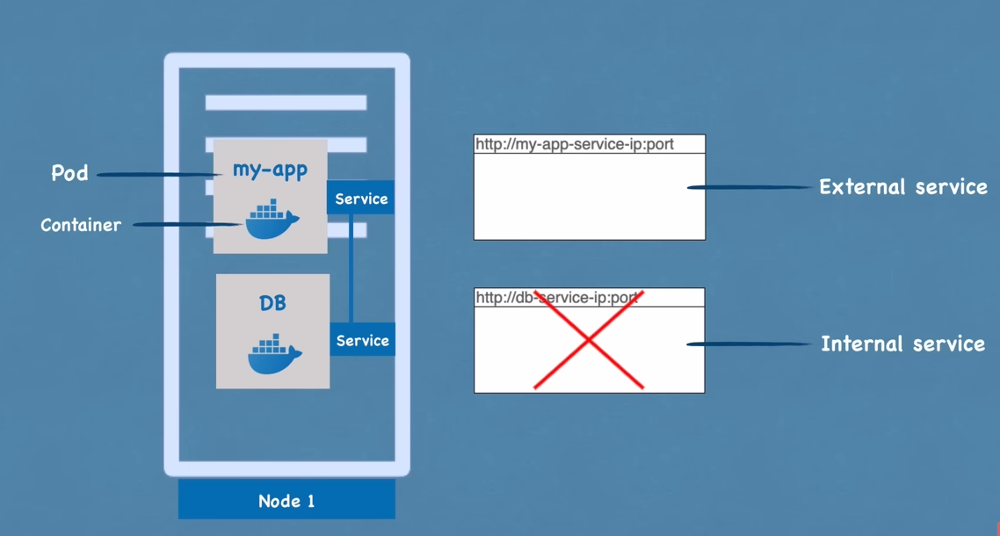

Ingress
- Ususally we want are url to look good something like https://my-appp.com if we want to talk to our application with a secure protocol and a domain name and for that there is another component of kubernetes called Ingress
- Instead of service the request goes first to Ingress and it does the forwarding then to the service

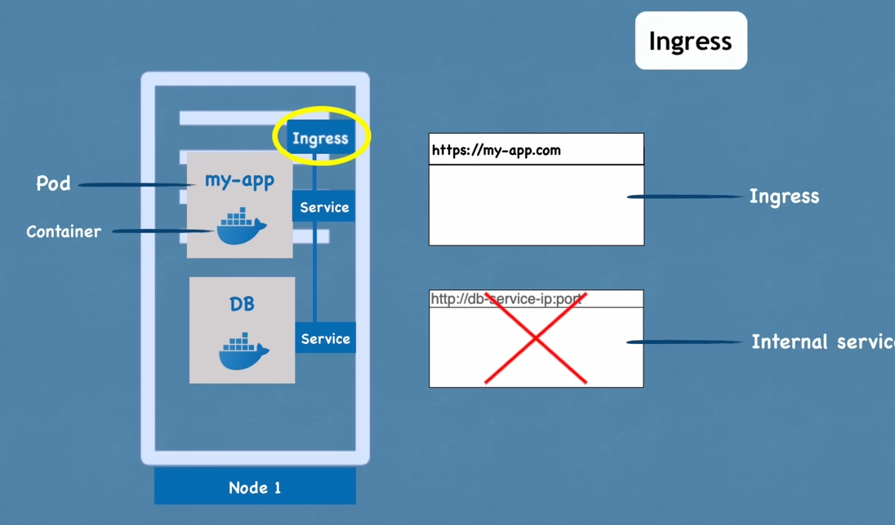

ConfigMap and Secrets

- Pods communicate with each other using a service so our application will have a database endpoint let's say called mongodb service that it uses to communicate with the database but where do we configure usually this database URL or endpoint usually we would do it in application properties file or as some kind of external environmental variable but usually it's inside of the built image of the application so for example if the endpoint of the service or service name in this case changed to mongodb we would have to adjust that URL in the application so usually we'd have to rebuild the application with a new version and we have to push it to the repository and now we'll have to pull that new image in our pod and restart the whole thing so a little bit tedious for a small change like database URL so for that purpose kubernetes has a component called configmap

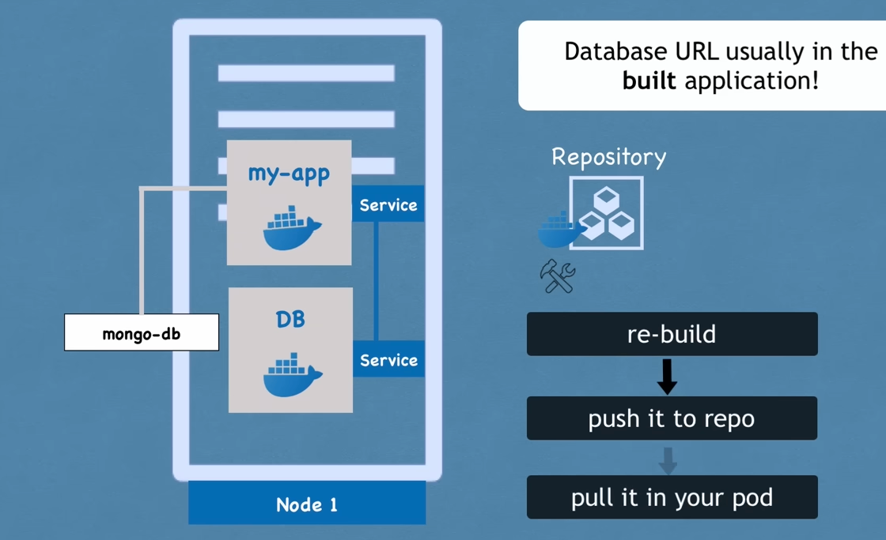

ConfigMap
- what it does is it's basically our external configuration to our application
- Config map would usually contain configuration data like URLs of a database or some other services that we use and in kubernetes we just connect it to the Pod so that pod actually gets the data that configmap contains
- now if we change the name of the service
, the endpoint of the service we just adjust the config map and that's it we don't have to build a new image

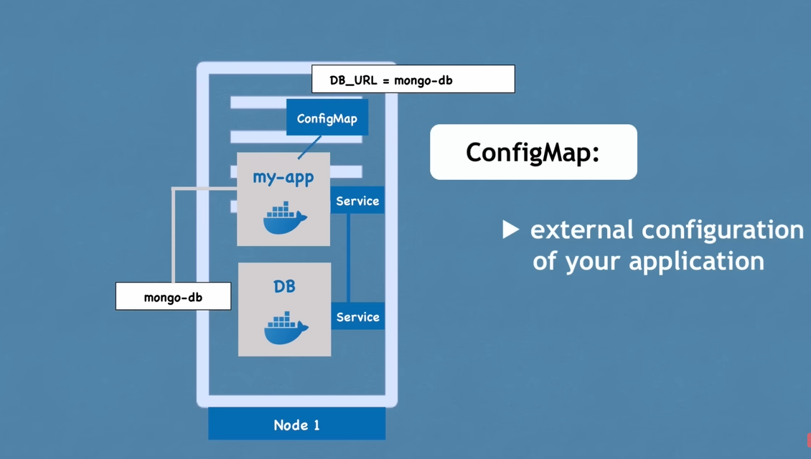

Secret
- Now putting password or other credentials in a cofig map can be insecure even though it's an external configuration so for this purpose kubernetes has another component called Secret
- secret is just like config map but the difference is that it's used to store secret data credentials for example
- it's stored not in a plain text format but in base in base 64 encoded format 
- secret would contain things like credentials, password certificates

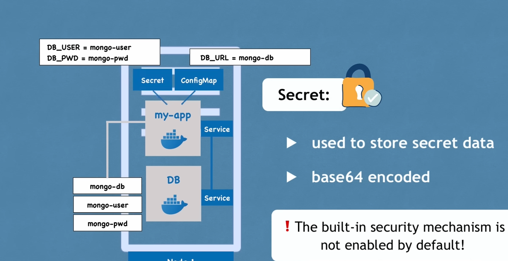

- Use the data from config map secret as using for example environmental variables or even as a properties file

Volumes

- If the database container or the Pod in below setting gets restarted the data would be gone and that's problematic and inconvenient

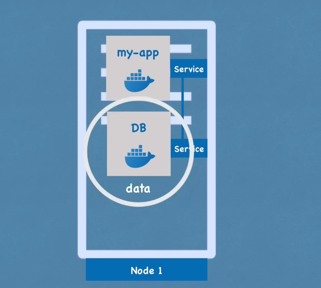

- We want our database data or log data to be persisted reliably long term and the way we can do it in kubernetes is using another component of kubernetes called volumes
- How it works is that it basically  attaches a physical storage on a hard drive to our pod and that storage could be either on a local machine meaning on the same server node where the Pod is running or it could be on the remote storage meaning outside of the kubernetes cluster it could be a cloud storage or it could be our own premise storage which is not part of the kubernetes cluster so we just have an external reference on it so now when the database pod or container gets restarted all the data will be there persisted

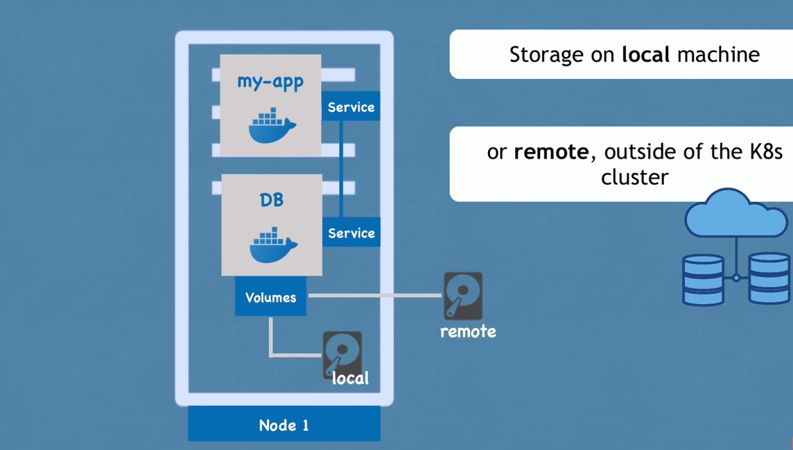

-  Think of a storage as an external hard drive plugged in into the kubernetes cluster as kubernetes explicitly does not manage data persistence which means that we as a kubernetes user or an administrator are responsible for backing up the data replicating and managing it and making sure that it's kept on a proper Hardware

Deployment and StatefulSet

- If our application pod dies right crashes or we have to restart the Pod because we built a new container image basically we would have a downtime where a user can reach my application
- So instead of relying on just one application pod and one database part
etc we are replicating everything on multiple servers so we would have another node where a replica or clone of our application would run which will also be connected to the service

- service is like an persistent static IP address with a DNS name so that we don't have to constantly adjust the endpoint when a pod dies but service is also a load balancer which means that the service will actually catch the request and forward it to whichever part is least busy

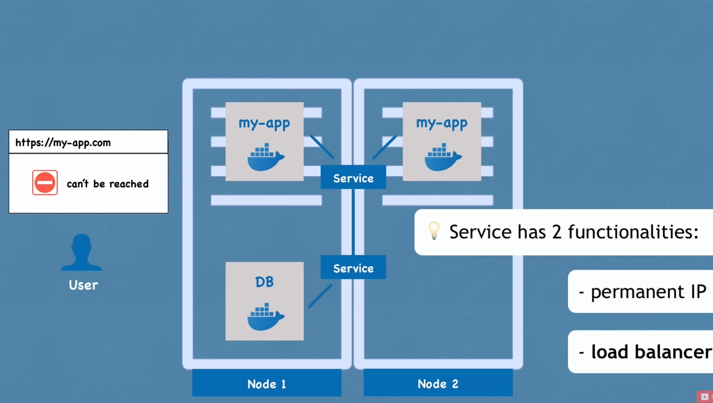

Deployment
- In order to create the the second replica of the my application pod we wouldn't create a second part but instead we would Define a blueprint for a my application pod
- And specify how many replicas of that pod we would like to run and that component or that blueprint is called deployment
-  In practice we would not be working with pulse or we would not be creating pods we would be creating deployments
- Pod we said that it is a layer of abstraction on top of containers and deployment is another abstraction on top of pods which makes it more convenient to interact with the pods replicate them and do some other configuration 
- So now if one of the replicas of our application pod would die the service will forward the requests to another one so our application would still be accessible for the user 

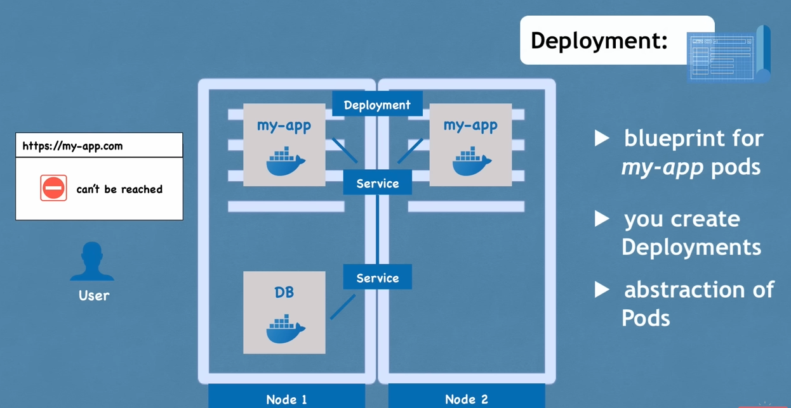

StatefulSet
- If the database part died our application also wouldn't be accessible so we need a database replica as well
- However we can't replicate database using a deployment because database has a state which is its data meaning that if we have clones or replicas of the database they would all need to access the same shared data storage and
- There we would need some kind of mechanism that manages which pods are currently writing to that storage or which pods are reading from that storage in order to avoid the data inconsistencies and that mechanism in addition to replicating feature is offered by kubernetes component called stateful set
- It is meant specifically for applications like databases so MySQL mongodb elasticsearch or any other stateful applications or databases should be created using stateful sets and not deployments

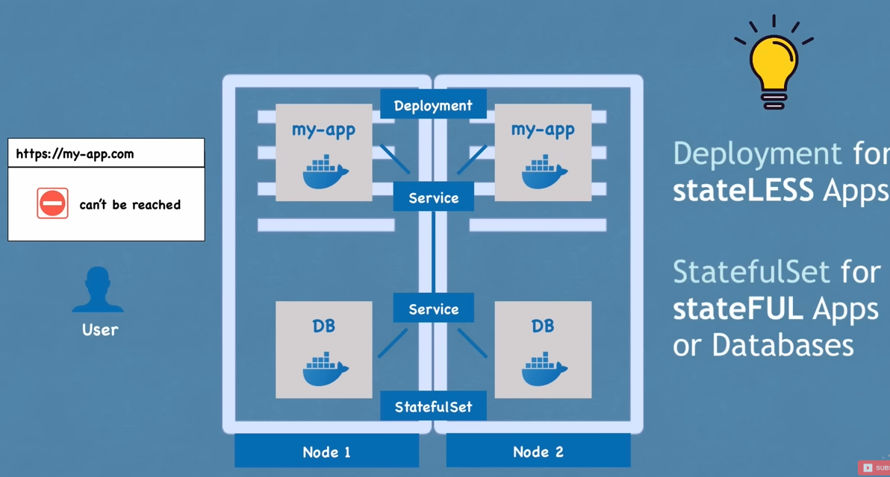

-  Deploying database applications using stateful sets in kubernetes cluster can be somewhat tedious so it's definitely more difficult than working with deployments
- A common practice is to host database applications outside of the kubernetes cluster and just have the deployments or stateless applications that replicate and scale with no problem inside of the kubernetes cluster and communicate with the external database

- So now that we have two replicas  they're both load balanced our setup is more robust which means that now even if Node 1 the whole node server was actually rebooted or crashed and nothing could run on it we would still have a second node with application and database pods running on it and the application would still be accessible by the user until these two replicas get recreated so you can avoid downtime

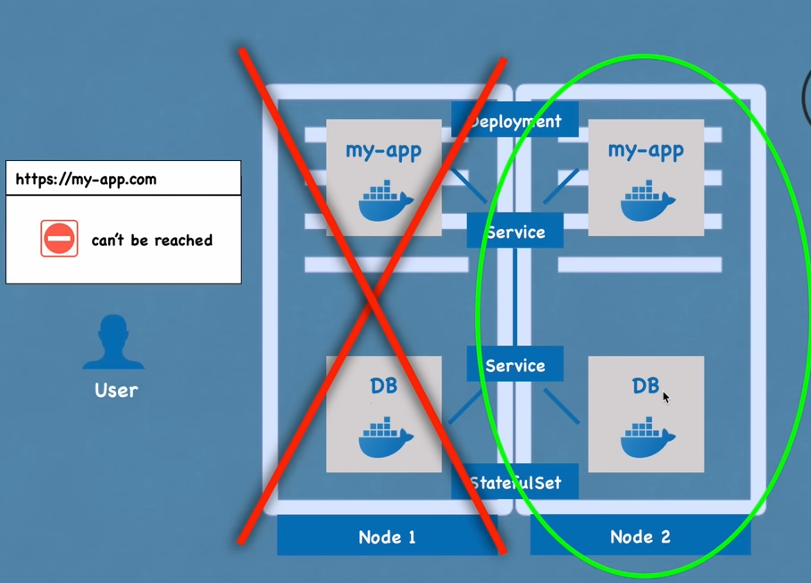

Summarize:

1. We start with the pods and the services in order to communicate between the parts  
2. The Ingress component which is used to Route traffic into the cluster 
3. We've also looked at external configuration using config maps and secrets and data persistence using volumes
4. Finally we've looked at pod blueprints with replicating mechanisms like deployments and stateful sets where stateful set is used specifically for stateful applications like databases
