# Kubernetes Core Concepts Overview

## Pod
- **Smallest unit** of Kubernetes (K8s)
- **Abstraction over container(s)**
- **1 application per Pod** (typical use case)
  - Can run multiple containers (e.g., main app + helper containers)
- **Each Pod gets unique IP address**
- Lifecycle considerations:
  - Pods are ephemeral (can crash/restart)
  - New IP assigned after restart → requires Service component

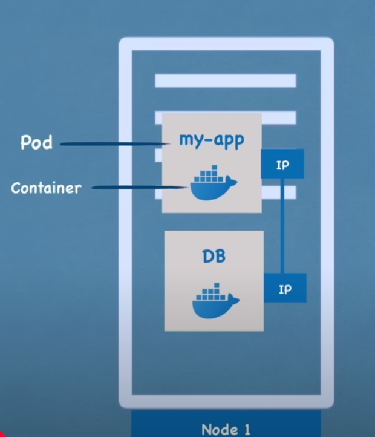

## Service
- **Static IP address** attached to Pod(s)
- **Decoupled lifecycle** from Pods
- Two main types:
  - **External Service**: Public-facing (browser accessible)
  - **Internal Service**: Private (e.g., database access)
- Acts as load balancer for Pod replicas

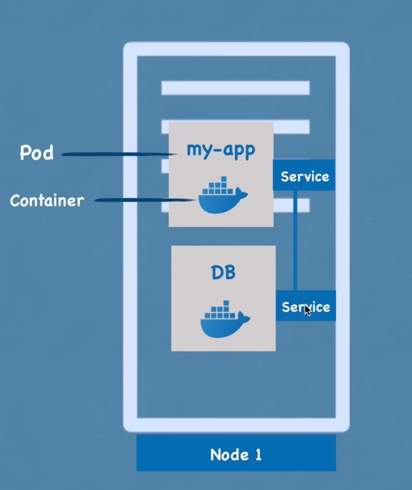
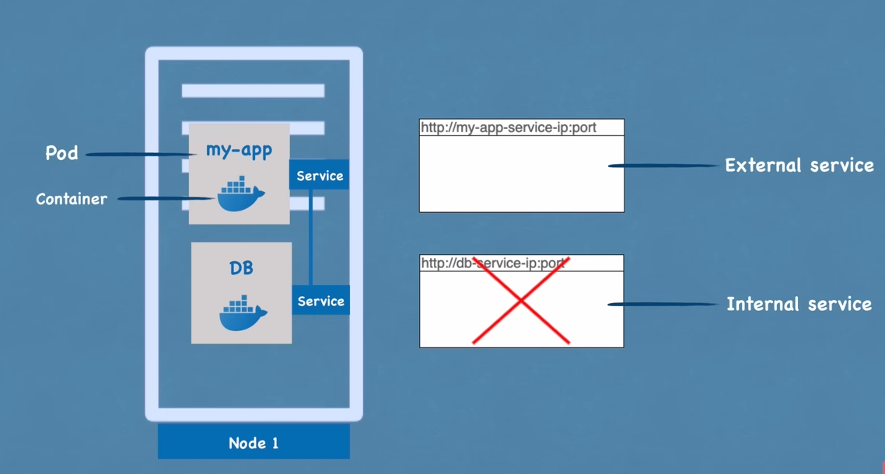

## Ingress
- **Route external requests** to internal services
- Enables:
  - **Custom domains** (e.g., `https://my-app.com`)
  - **SSL termination**
  - **Path-based routing**

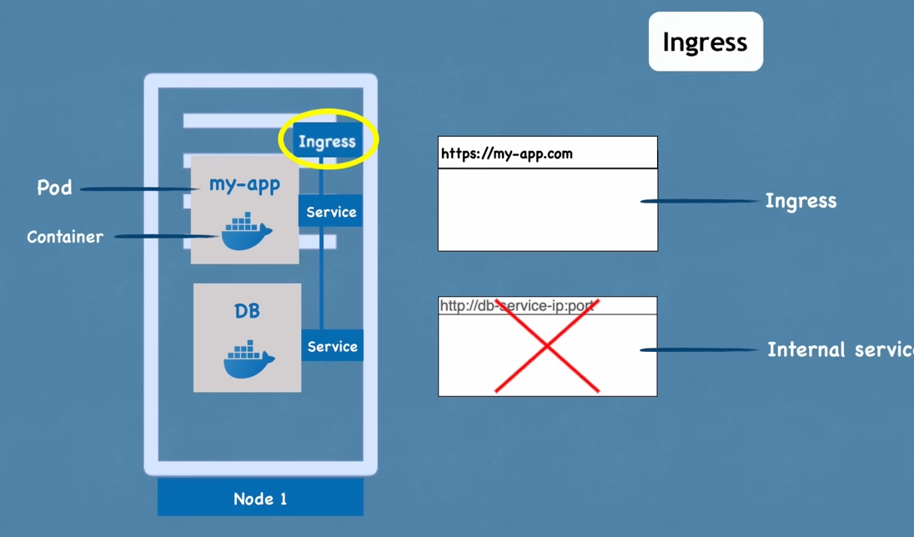

## Configuration Management
### ConfigMap
- **External configuration** store
- Stores non-sensitive data:
  - Database URLs
  - Service endpoints
- Avoids need to rebuild images for config changes

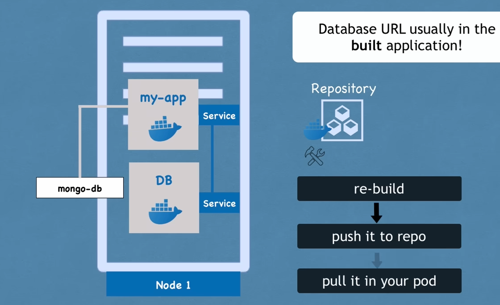
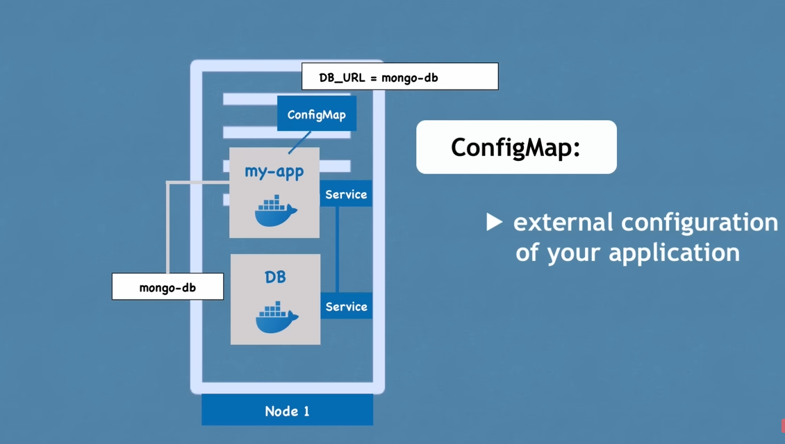

### Secret
- **Secure credential storage**
- Stores sensitive data:
  - Passwords
  - API keys
  - Certificates
- **Base64 encoded** (not encrypted!)

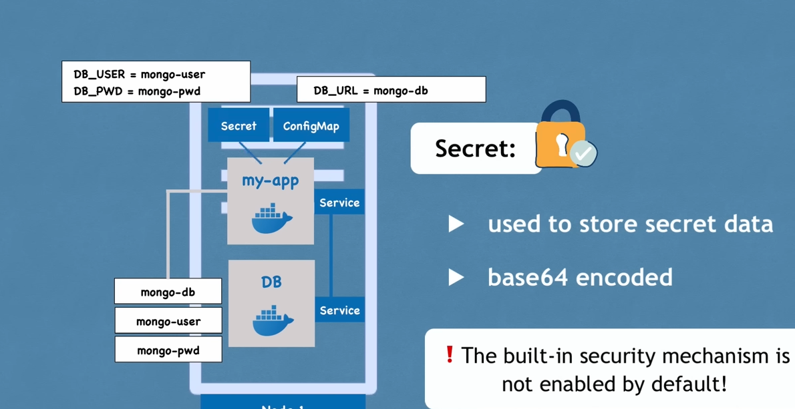

## Data Persistence
### Volumes
- **Persistent storage** solution
- Types:
  - Local storage (node-specific)
  - Remote storage (cloud/NAS)
- Essential for stateful applications (e.g., databases)

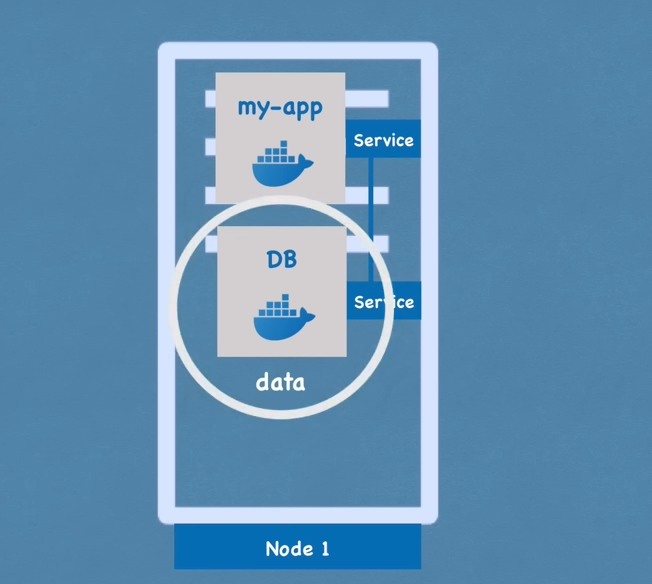
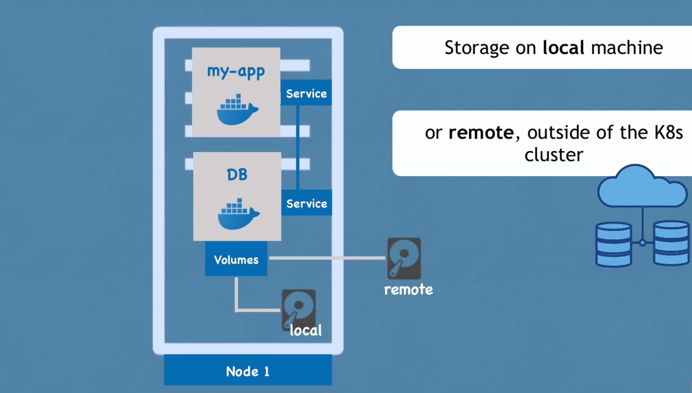

## Scaling & High Availability
### Deployment
- **Pod blueprint** for stateless apps
- Features:
  - Replication
  - Rolling updates
  - Self-healing
- Manages Pod replicas behind Service

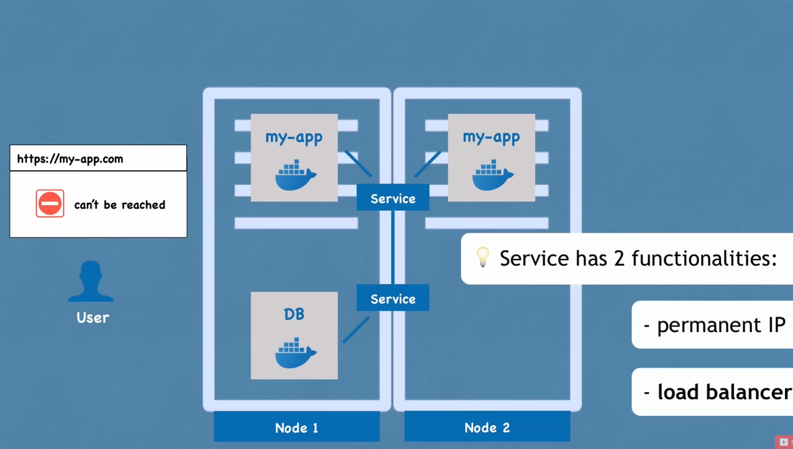
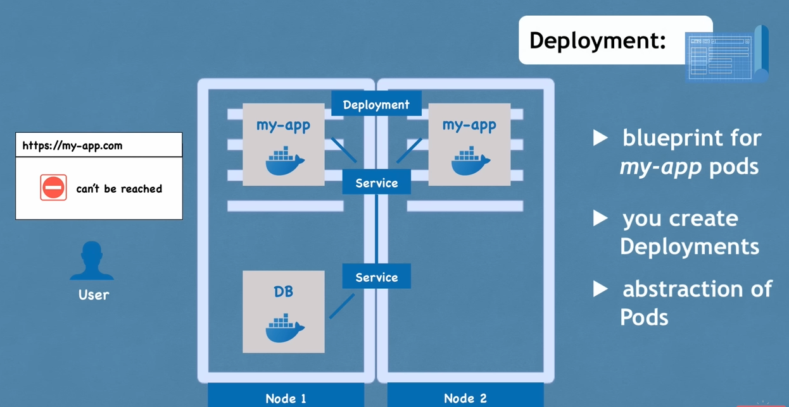

### StatefulSet
- **Database-specific** management
- Handles:
  - Ordered deployments
  - Stable network identifiers
  - Persistent storage
- Complex to manage → often hosted externally

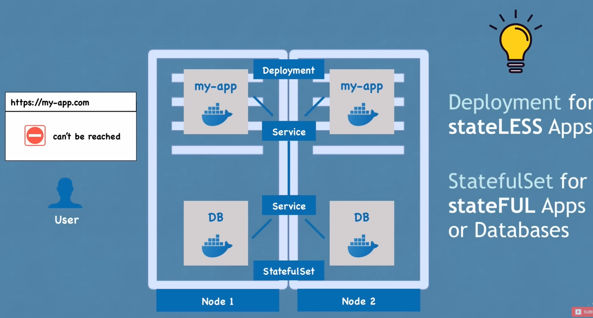
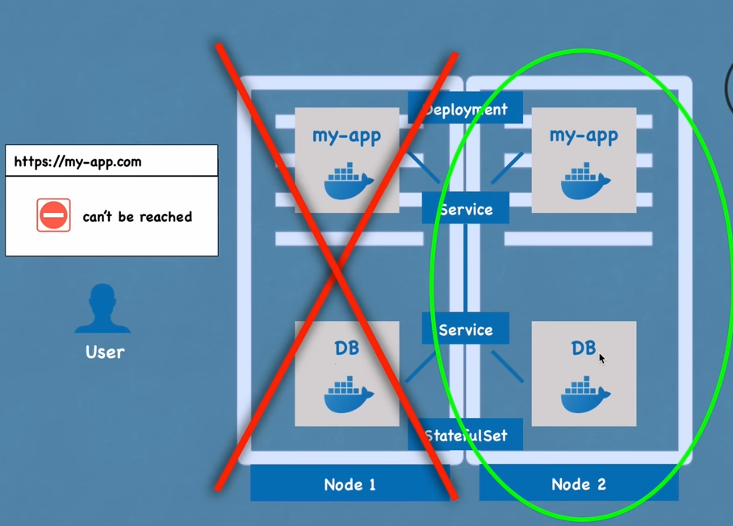

## Architecture Summary
1. **Pods & Services**: Basic communication units
2. **Ingress**: External traffic routing
3. **ConfigMap/Secrets**: External configuration
4. **Volumes**: Data persistence
5. **Deployments/StatefulSets**: Scaling & reliability

> **Key Takeaway**: Use Deployments for stateless apps, StatefulSets for databases, and always pair with Services for stable networking.