Basic Kubectl commands

Get status of differennt components
- command: kubectl get nodes

- we see that there is one node which is a muster and everything is going to run on that node because it's a minikube 

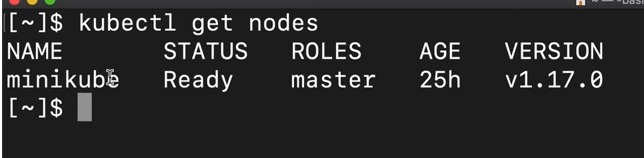

Check the pods
- command: kubectl get pod

- can check the pods and we don't have any that's why no resources

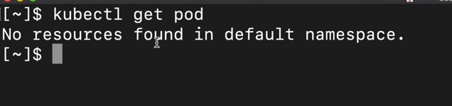

Check the services
- command: kubectl get services

- can check the services it keeps it will get services and we just have one default service and so on so this kubectl  get atleast any kubernetes components

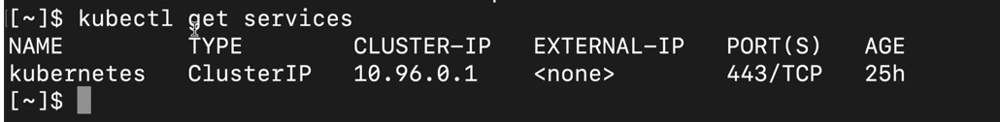

Create and Edit a Pod
- If we do help on kubectl create command we can see available commands
- command: kubctl create -h

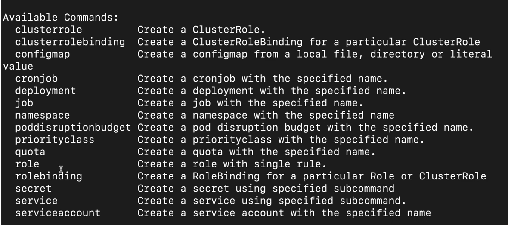

But there is not pod on the above list as we are not creating any pod, in practice we are creating deployment so this is what we are going to be creating and that's going to create the parts unde rneath and this is a usage of kubectl create deployment

- need to give a name of the deployment and then provide some options and the option that is required is the image because the Pod needs to be created based on certain some image or some container image

- command: kubectl create deployment NAME --image=image [--dry-run] [options]

-  let's actually go ahead and create nginx deployment

- command: kubectl create deployment nginx-depl --image=nginx

- It's not ready yet so if we do kubectl get part we see that now we have a pod which has a prefix of the deployment and some random hash here and it says container creating so it's not ready 

- command: kubectl get pod

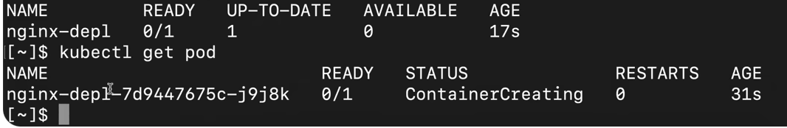

- so if we do it again it's running 

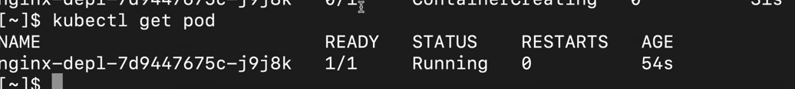

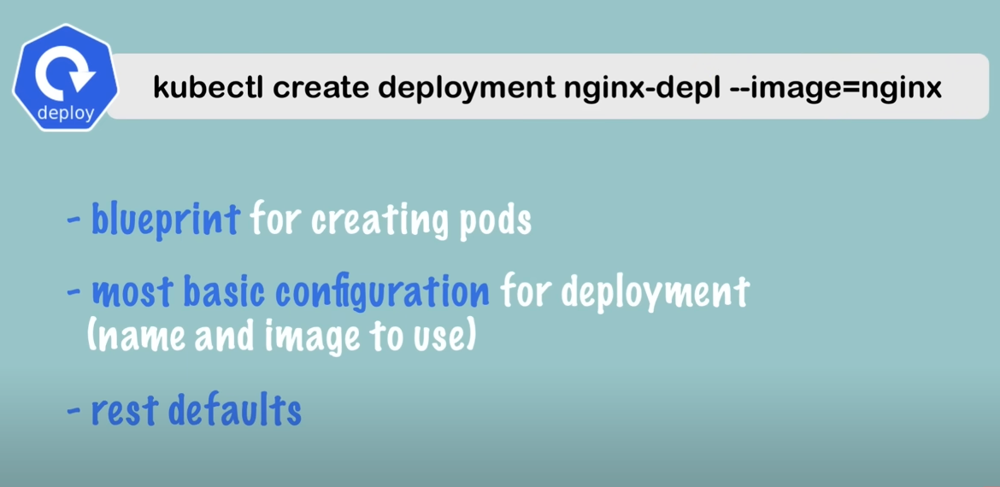

ReplicaSet
- Between deployment and pod there is another layer which is automatically managed by kubernetes deployment called replicaset 

- commond: kubectl get replicaset

- Notice here the Pod name has a prefix of deployment and the replica sets ID and then its own ID so this is how the Pod name is made up 

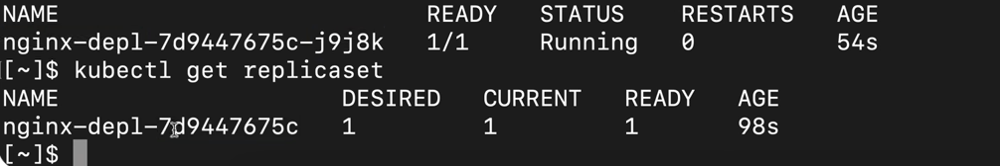

- Replicaset basically is managing the replicas of a pod
- In practice will never have to create replica set or delete a replica set or update in any way
-  Going to be working with deployments directly which is more convenient because in deployment we can configure the Pod blueprint completely,  can say how many replicas of the part we want and we can do the rest of the configuration there

- First we have the deployment the deployment manages a replica set 
- A replica set manages all the replicas of that pod and 
- The Pod is again an abstraction of a container and 
- Everything below the deployment should be managed automatically by kubernetes we shouldn't have to worry about any of it 

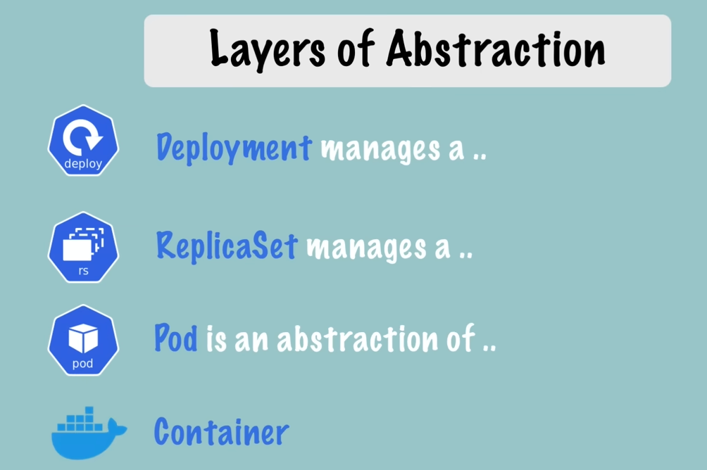

Edit image in deployment
- command: kubectl edit deployment nginx-depl

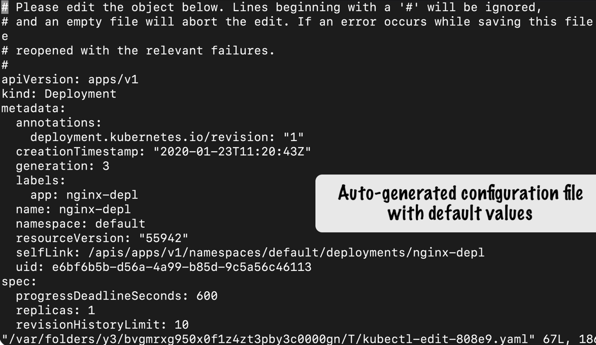

-  we get an auto generated configuration file of the deployment because in the command line we just gave two options everything else is default and auto generated by kubernetes

- scroll to the image which is somewhere down below and let's say we wanted to fixate the version to 1 16. and save that change

- now when we do kubectl get pod we see that the old part so this one here is terminating and another one started 25 seconds ago so if we do it again the old part is gone and the new one got created with the new image 

-  if we get replica set we see that the old one has no pods in it and a new one has been created as well so we just edited the deployment configuration and everything else below that got automatically updated 

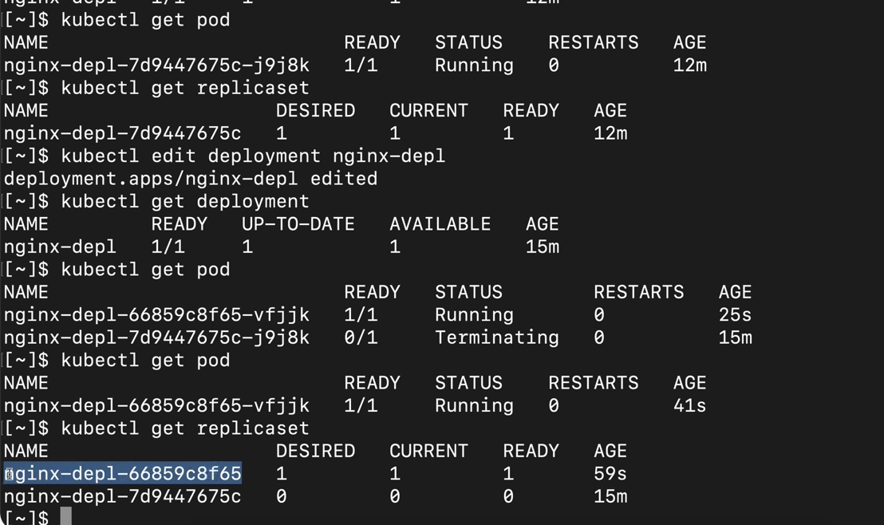

kubectl logs which basically shows we what the application running inside the Pod 

- first create another deployment 
- command: kubectl create deployment mongo-depl --image=mongo

- But the container inside the Pod isn't running yet and when we try to log obviously it tells us there is no container running
- command: kubectl logs podname

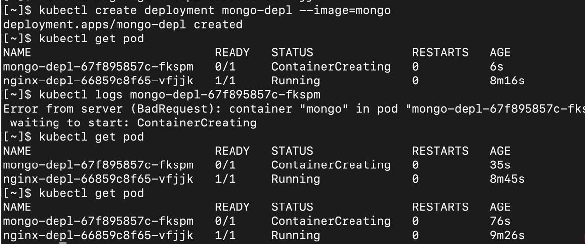

- We can actually get some additional information by kubectl describe pod and the Pod name which here shows us what state changes happen inside the part so it pulled the image created the container and start a container so kubectl get pod 

- command: kubectl describe pod podname 

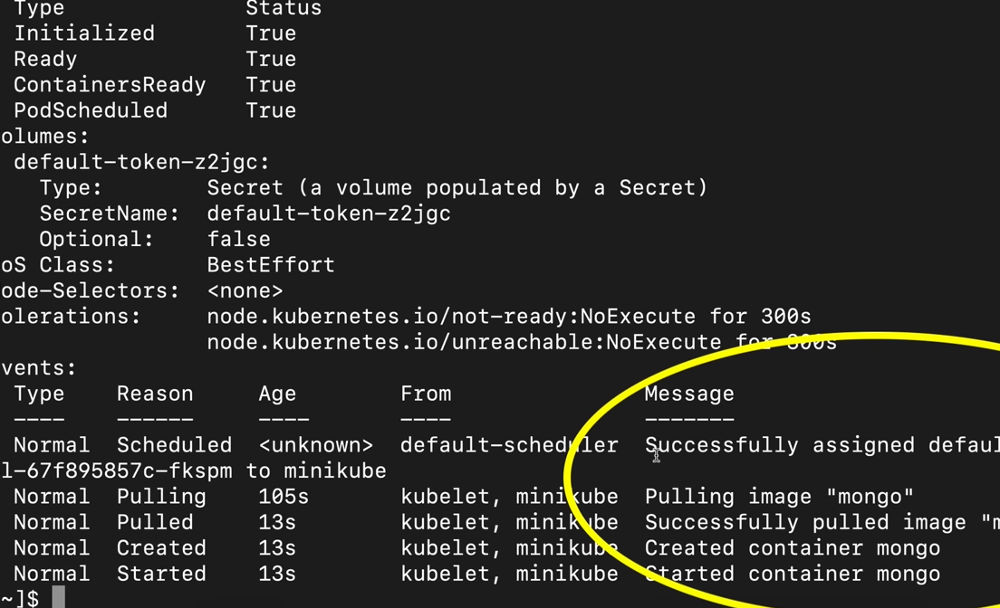

- Now do kubectl get pod to check the pod

- command: kubectl get pod

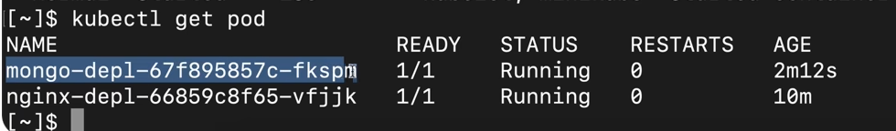

-Now check the logs

- command: kubctl logs podname

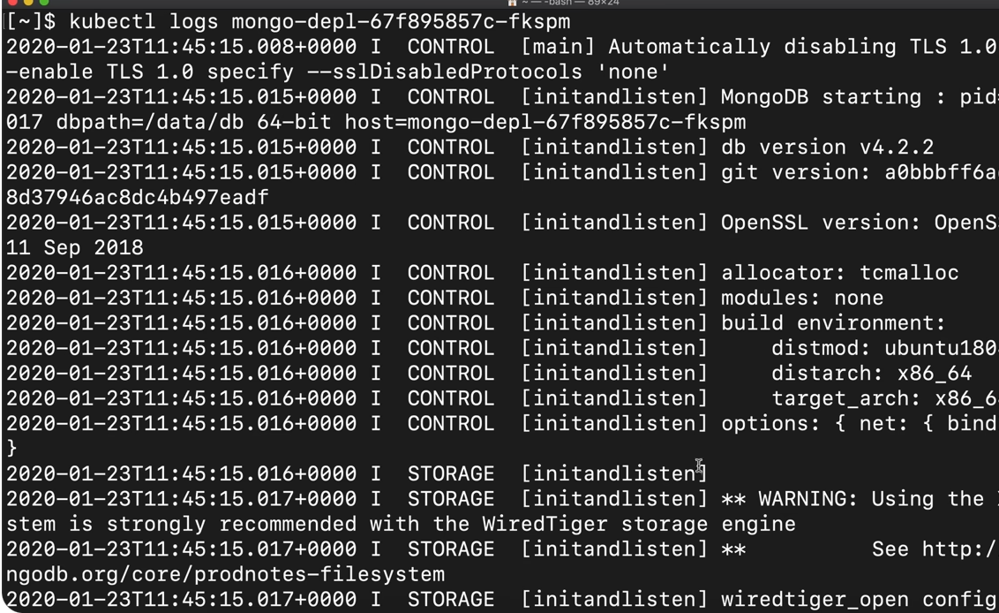

- If we just want to check what's going inside Pod is kubectl exec so basically what it does is that it gets the terminal of that mongodb application container so if we do kubectl exec interactive terminal that's what it stands for we will need the Pod name Dash Dash so so with this command we get the terminal of the mongodb application container and as we see here we am inside the container of mongodb as a root user so we are in a completely different setting now 

- command: kubectl exec -it podname -- bin/bash

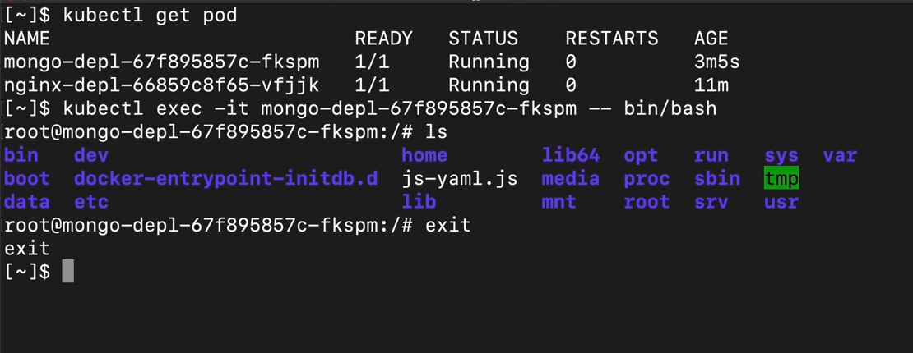

Delete deployment and Apply configuration file

- command: kubectl get deployment

- we see that we have two of them and if we do because it get pod and replica set we have also two of them 

- If we wanted to get rid of all the pods replica sets underneath we will have to delete the deployment so delete deployment 

- command: kubectl delete deployment deploymentname

- Now kubectl get pod the pod should be terminating and if we do get replica set the mongodb replica set is gone as well

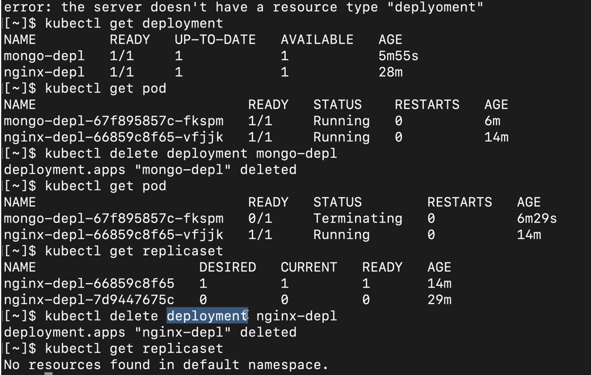

Configuration file
- We notice when we are creating kubernetes components like deployment using cubectl Create deployment have to provide all these options on the command line so we'll have to say the name and we'll have to specify the image and then we have this option one option two etc and there could be a lot of things that we want to configure in a deployment or in a pod and obviously it will be impractical to write that all out on a command line so because of that in practice we would usually work with kubernetes configuration files

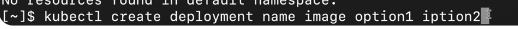

- What component you're creating what the name of the component is what image is it based off and any other options they're all gathered in a configuration file 

- It is using kubectl apply command and apply basically takes the file the configuration file as a parameter and does whatever you have written there so apply takes an option called minus F that stands for file and here you would

- command: kubectl apply -f filname.yaml

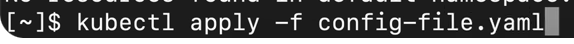

- create the configuration file

- How many replicas of the parts we want to create and this plug right here the template and specification is a blueprint for the pods
we're just saying we want one container inside of the pod with nginx image and we are going to bind that on Port 80.

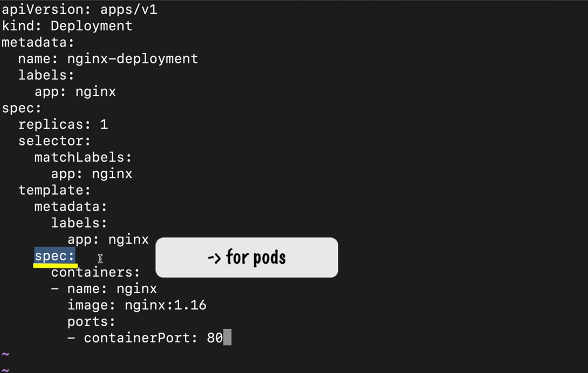

- So this is going to be our configuration file and once we have that we can apply that configuration

- command: kubectl apply -f nginx-deployment.yaml

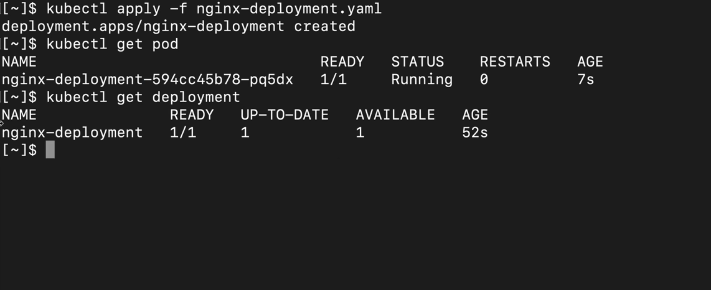

- If we wanted to change something in that deployment we can actually change my local configuration for example we wanted two replicas instead of one we can apply that again deployment nginx deployment configured

- command: vim deploymentfile.yaml

- kubernetes can detect if the nginx deployment doesn't exist yet it's going to create one but if it already exists and we apply the configuration file again it's going to know that it should update it instead of creating a new one 

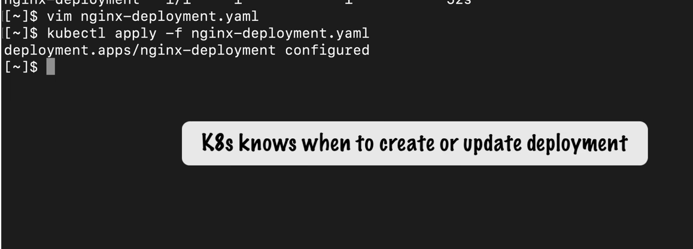

- So if we do get deployment we see this is the old one or the old deployment and if we do kubectl get part we see the old one is still there and a new one got created because we increased the replica count which means that with kubectl apply you can both create and update a component 

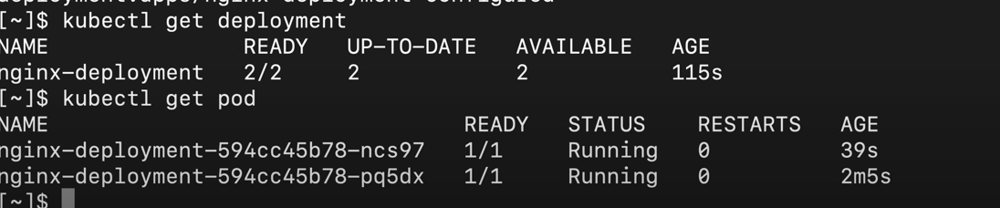

- We can do kubectl with services volumes any other kubernetes components just like we did it with the deployment

- Summarize

1.  We saw how to create a component like deployment how to edit it and delete it
2. We saw how to get status of PODS deployments replica sets cetera
3. We also logged on the console whatever application is writing it to the console in the Pod
4. We saw how to get a terminal of a running container using cubectl exec
5. We saw how to use a kubernetes configuration file to create and update components using the kubectl apply command
6. We saw Cube CTL describe command which will win a container isn't starting in a pod

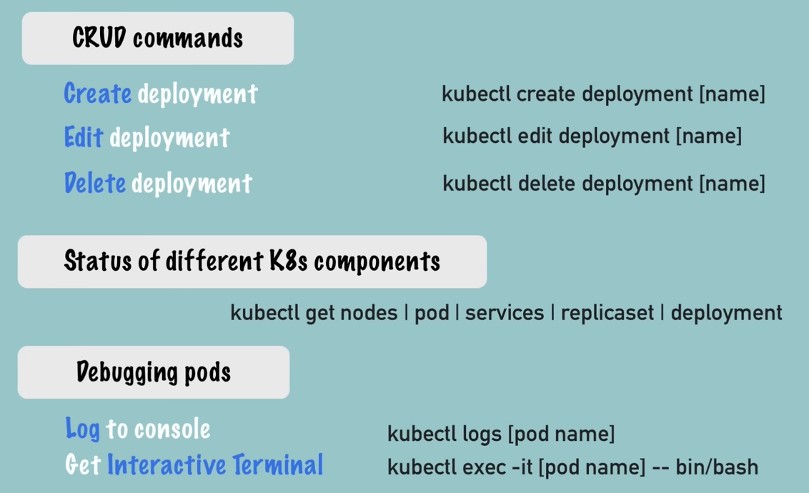

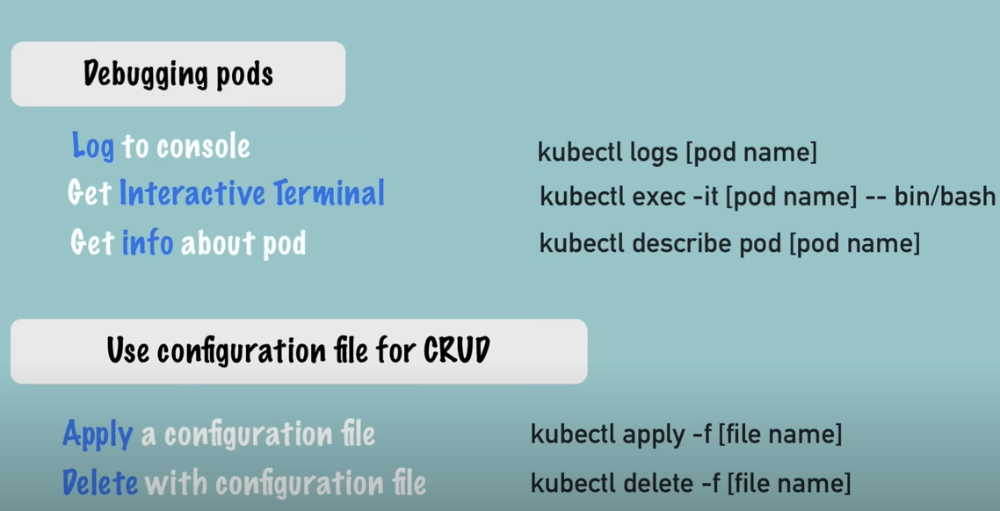