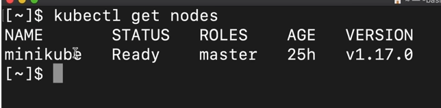
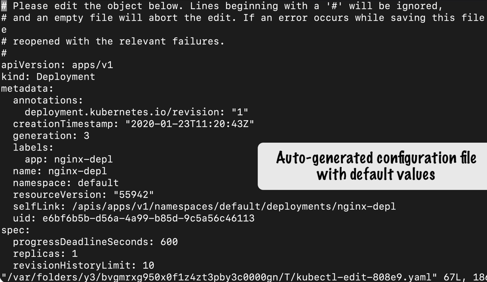
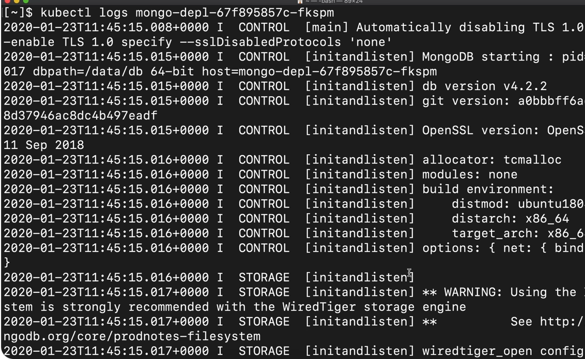
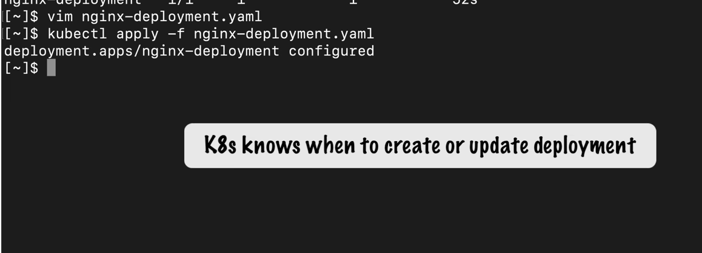
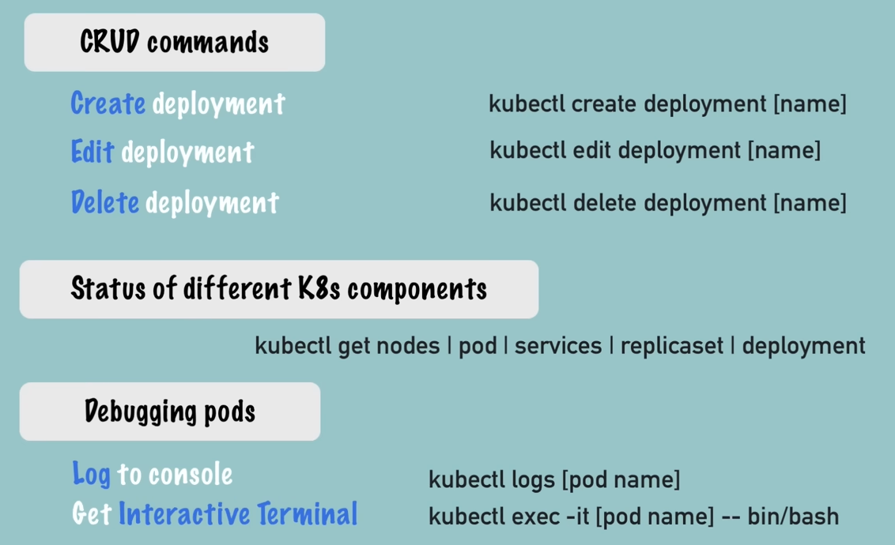
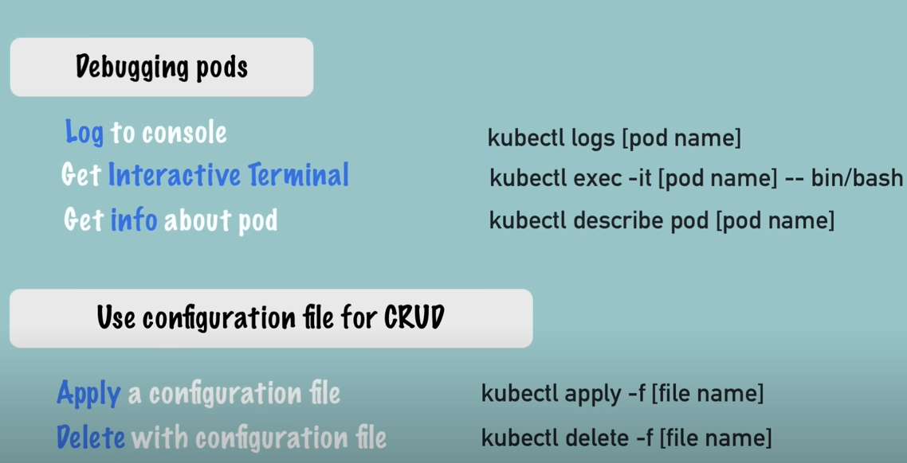

---

# Basic kubectl Commands

## Overview
`kubectl` is the primary command-line tool for interacting with Kubernetes clusters. Below are essential commands for managing and monitoring Kubernetes resources.

---

## Get Status of Components

### Check Node Status
```bash
kubectl get nodes
```
**Output:**
```
NAME       STATUS   ROLES    AGE   VERSION
minikube   Ready    master   5m    v1.23.3
```



---

### Check Pods
```bash
kubectl get pods
```
**Output:**
```
No resources found in default namespace.
```


---

### Check Services
```bash
kubectl get services
```
**Output:**
```
NAME         TYPE        CLUSTER-IP   EXTERNAL-IP   PORT(S)   AGE
kubernetes   ClusterIP   10.96.0.1    <none>        443/TCP   5m
```


---

## Create and Manage Deployments

### Create a Deployment
```bash
kubectl create deployment nginx-depl --image=nginx
```

### Check Deployment Status
```bash
kubectl get deployments
```
**Output:**
```
NAME         READY   UP-TO-DATE   AVAILABLE   AGE
nginx-depl   1/1     1            1           1m
```

### Check Pods Created by Deployment
```bash
kubectl get pods
```
**Output:**
```
NAME                          READY   STATUS    RESTARTS   AGE
nginx-depl-5c8d5f4b6c-8k9q7   1/1     Running   0          2m
```


---

## ReplicaSet Management

### Check ReplicaSets
```bash
kubectl get replicasets
```
**Output:**
```
NAME                    DESIRED   CURRENT   READY   AGE
nginx-depl-5c8d5f4b6c   1         1         1       3m
```


---

## Edit a Deployment

### Edit Deployment Configuration
```bash
kubectl edit deployment nginx-depl
```
- Update the `image` field to `nginx:1.16` and save.

### Verify Changes
```bash
kubectl get pods
```
**Output:**
```
NAME                          READY   STATUS        RESTARTS   AGE
nginx-depl-5c8d5f4b6c-8k9q7   0/1     Terminating   0          5m
nginx-depl-6c8d5f4b6c-9k9q8   1/1     Running       0          10s
```




---

## Debugging and Logs

### View Pod Logs
```bash
kubectl logs <pod-name>
```
**Example:**
```bash
kubectl logs mongo-depl-5c8d5f4b6c-8k9q7
```



### Describe Pod
```bash
kubectl describe pod <pod-name>
```
**Example:**
```bash
kubectl describe pod mongo-depl-5c8d5f4b6c-8k9q7
```


### Access Pod Shell
```bash
kubectl exec -it <pod-name> -- /bin/bash
```
**Example:**
```bash
kubectl exec -it mongo-depl-5c8d5f4b6c-8k9q7 -- /bin/bash
```


---

## Delete a Deployment

### Delete Deployment
```bash
kubectl delete deployment <deployment-name>
```
**Example:**
```bash
kubectl delete deployment nginx-depl
```

### Verify Deletion
```bash
kubectl get pods
kubectl get replicasets
```


---

## Working with Configuration Files

### Apply Configuration File
```bash
kubectl apply -f nginx-deployment.yaml
```

**Example `nginx-deployment.yaml`:**
```yaml
apiVersion: apps/v1
kind: Deployment
metadata:
  name: nginx-deployment
spec:
  replicas: 2
  selector:
    matchLabels:
      app: nginx
  template:
    metadata:
      labels:
        app: nginx
    spec:
      containers:
      - name: nginx
        image: nginx:1.16
        ports:
        - containerPort: 80
```


### Update Configuration
1. Edit the YAML file:
   ```bash
   vim nginx-deployment.yaml
   ```
2. Reapply the configuration:
   ```bash
   kubectl apply -f nginx-deployment.yaml
   ```




---

## Summary of Key Commands

| Command                                      | Description                          |
|----------------------------------------------|--------------------------------------|
| `kubectl get nodes`                          | List cluster nodes                  |
| `kubectl get pods`                           | List all pods                       |
| `kubectl get services`                       | List all services                   |
| `kubectl create deployment <name> --image=<image>` | Create a deployment            |
| `kubectl edit deployment <name>`             | Edit a deployment                   |
| `kubectl logs <pod-name>`                    | View pod logs                       |
| `kubectl describe pod <pod-name>`            | Describe pod details                |
| `kubectl exec -it <pod-name> -- /bin/bash`   | Access pod shell                    |
| `kubectl delete deployment <name>`           | Delete a deployment                 |
| `kubectl apply -f <file.yaml>`               | Apply configuration from YAML file  |

---

## Workflow Diagram




---

> **Pro Tip:** Use `kubectl explain <resource>` to get detailed documentation for any Kubernetes resource. For example:
> ```bash
> kubectl explain deployment
> ```

---
