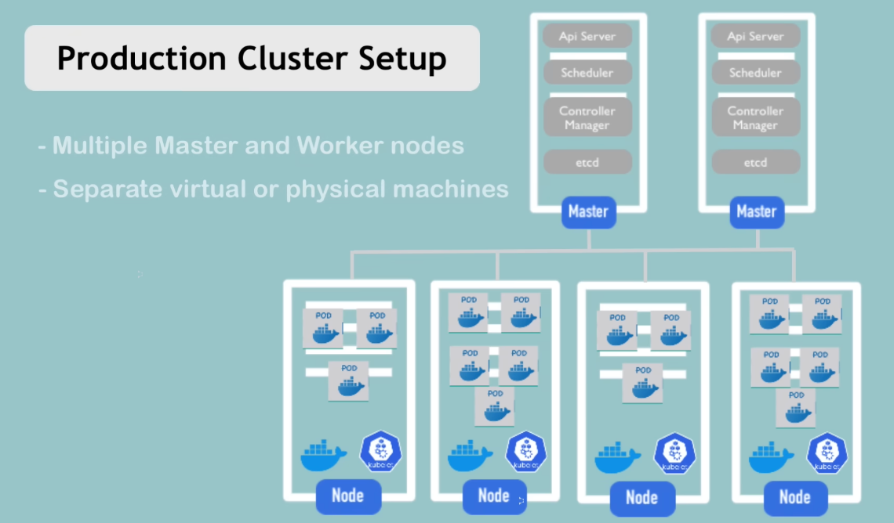
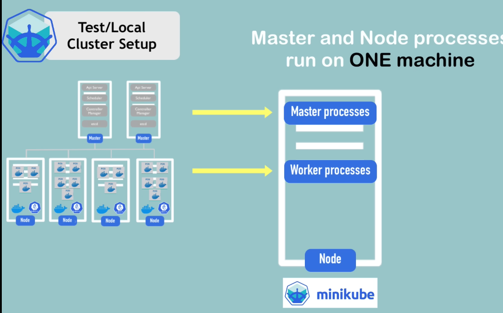
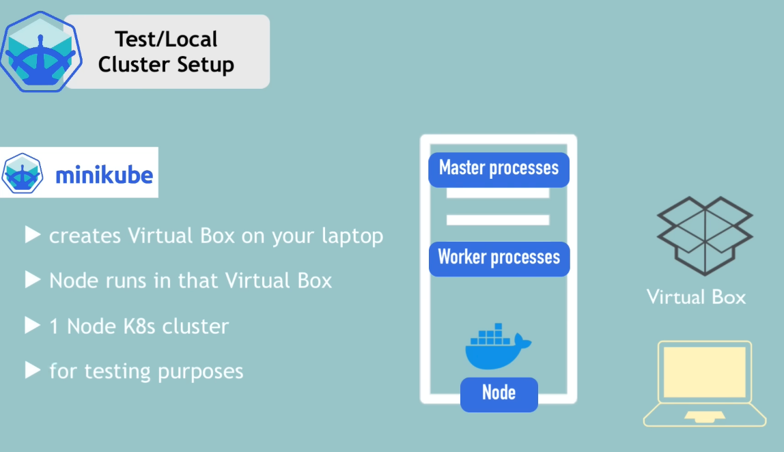
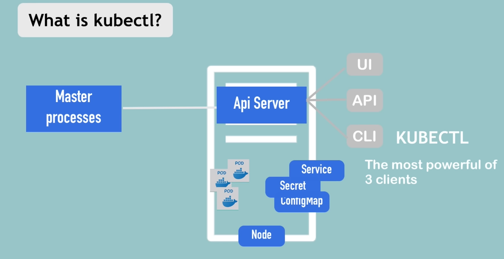
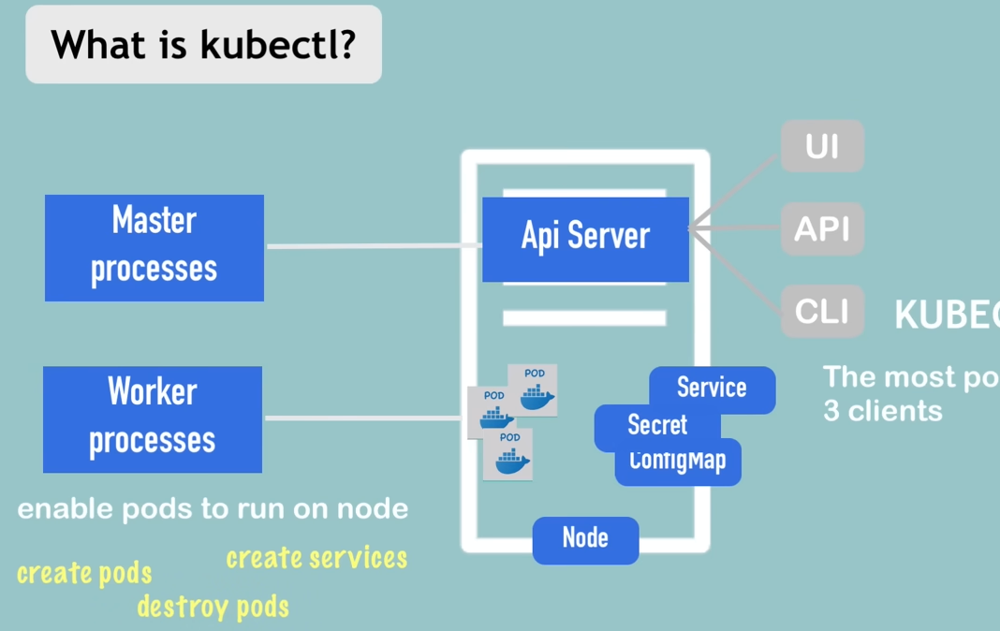
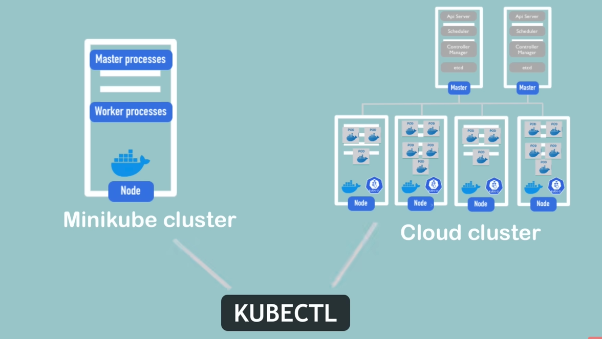
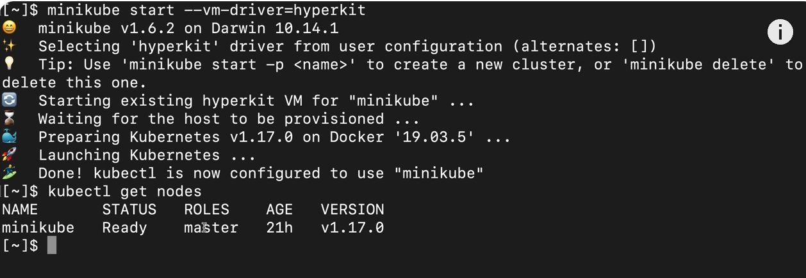
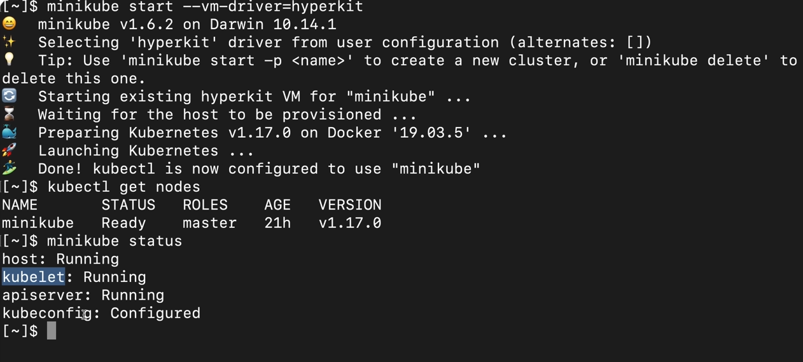
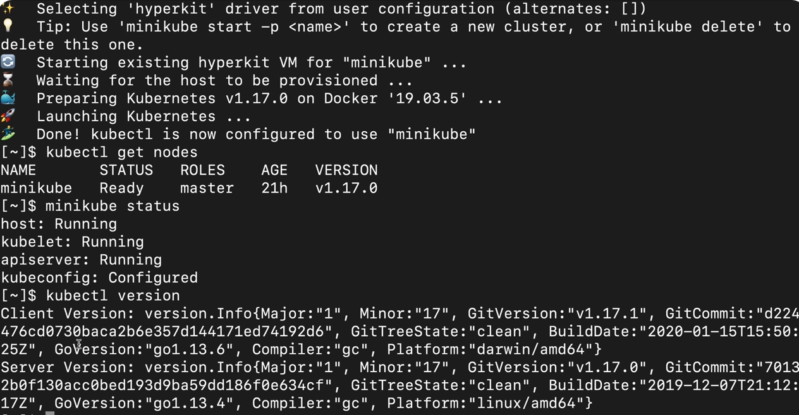

Minikube
- Setting up a production cluster would have multiple worker nodes and masternodes and the worker nodes have their own separate responsibility as seen in the diagram

- If we want to try something out very quickly for example deploying new application or new components and we want to test it on our local machine obviously setting up a cluster like this will be pretty difficult or maybe even impossible if we don't have enough resources like memory and CPU etc
- Therefore, mini cube is is basically one node cluster where the master processes and the work processes both run on one node
- This node will have a Docker container runtime pre-installed
- We will be able to run the containers or the pods with containers on this node and the way it's going to run on our laptop is through a virtual box or some other hypervisor

- Basically minicube will create a virtual box on our laptop and the nodes that we see here of this node will run in that virtual box so to summarize minicube is a one node kubernetes cluster that runs in a virtualbox on our laptop which we can use for testing kubernetes on our local setup 

Kubectl
- After setting up the cluster we need some way to interact with a cluster that is why we want to create components,  configure it Etc and that's where kubectl comes in the picture
- So we need a way to create pods and other kubernetes components on the Node and the way to do it is using kubectl which is a command line tool for kubernetes cluster

- If we want to configure anything create any component we first had to talk to the API server
- The way to talk to the API server is through different clientsa UI like a dashboard you can talk to it using kubernetes API or a command line tool which is kubectl and kubectl is actually the most powerful of all the three clients because with kubectl you can basically do anything in the kubernetes that we want

- kubectl isn't just for minicube cluster if you have a cloud cluster or a hybrid cluster whatever kubectl is the tool to use to interact with any type of kubernetes cluster setup

Installation steps for Minikube

Step 1:
- Install Hypervisor (it's going to run in a virtual box setup or some hypervisor)

- command:  brew update
            brew install hyperkit
            brew install minikbe (it has kubectl as a dependency)

Step 2: After installing check the list of the commands installed
- command:  kubectl
            minikube

- minikube comes with Basic Commands:
  start            Starts a local Kubernetes cluster
  status           Gets the status of a local Kubernetes cluster
  stop             Stops a running local Kubernetes cluster
  delete           Deletes a local Kubernetes cluster
  dashboard        Access the Kubernetes dashboard running within the minikube
cluster
  pause            pause Kubernetes
  unpause          unpause Kubernetes

Step 3: Create and start the cluster
- command: minikube start --vm-driver=hyperkit

- since minikube needs to run in virtual environment we're gonna tell minikube which hypervisor it should use to start a cluster 
- we're going to specify an option which is VM driver
- going to set the hyperkey that we installed, telling minicube please use hyperkit hypervisor to start this virtual minikube cluster

Step 4:
- after this gets exected minikube cluster is set up kubectl command which is meant to interact with the kubernetes 
- Clusters is also connected with that minikube cluster which means if we do kubectl get nodez which just gets us a status of the notes of the kubernetes cluster
- command: kubectl get nodes

- we can see it's the only node and it has a must roll because it obviously has to run the master processes

Step 5:
- command: minikube status
- We see we're using 1.17 and that's the kubernetes version that is running in the minicube cluster so if we see both client version and server version in the output it means that minicube is correctly installed

