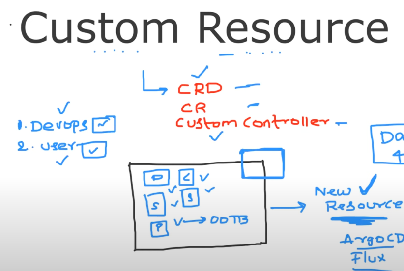
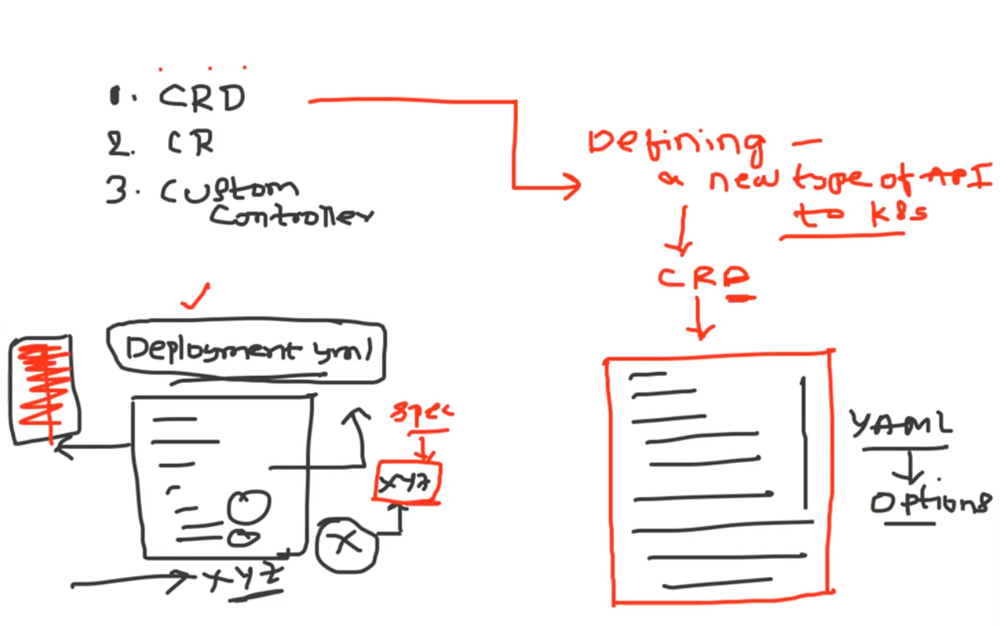
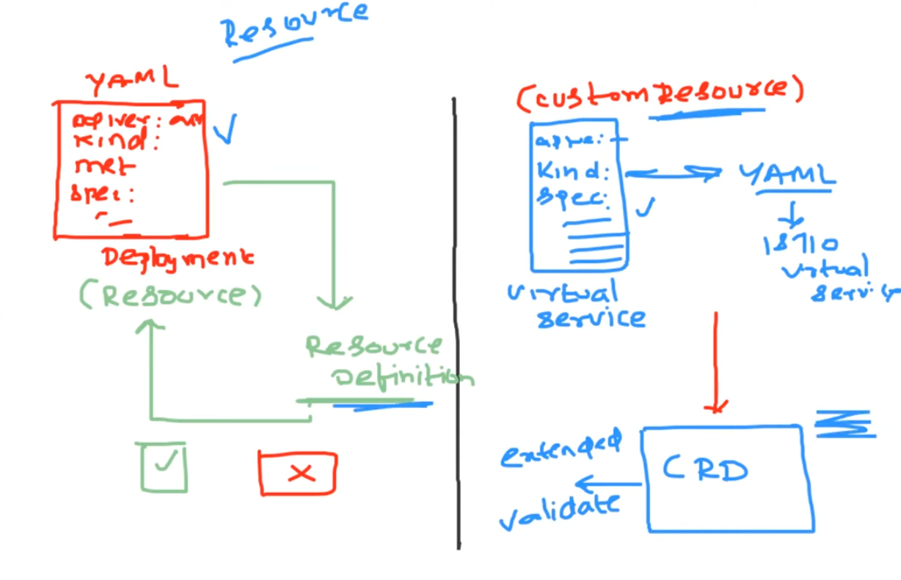
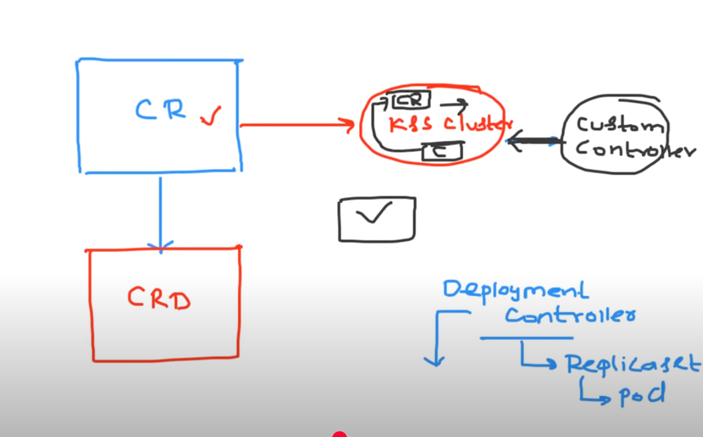
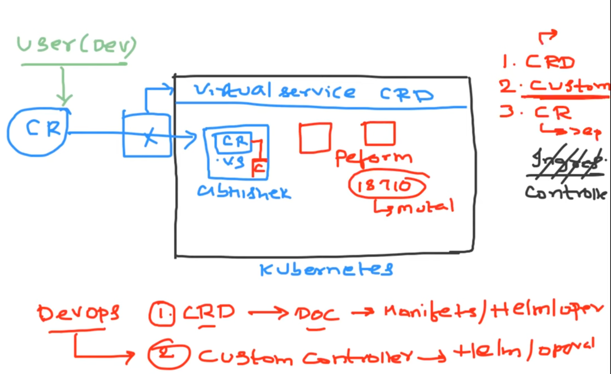
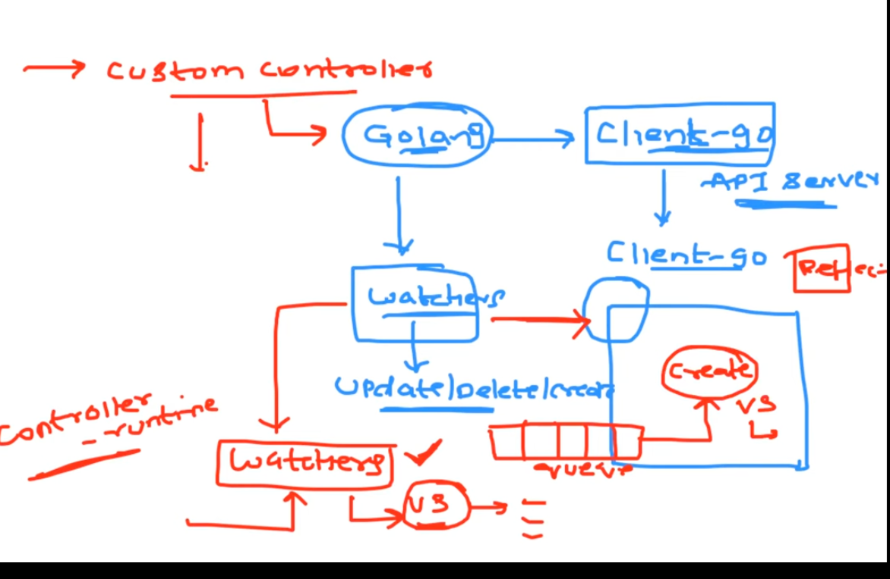

Custom Resource Defintion (CRD)

- If we want to extend the api of kubernetes or we want to introduce a new resource to kubernetes. Suppsoe we want advance security so k8s does not support these problems then in order to get these we need to introduce custom resource

- Deploying the CRD and the custom controller repository is the reponsibility of the devops engineer
Deploying the custom resource can be the action of user or devops engineer

- user ->deployed application -> service -> ingress -> configmap -> secret 

- after a while we realised there is world beyond native kubernetes resources like isito(which add service based capabilities) or argocd(which adds gitops based capabilities to our server) or there is an application called keyclock(which adds oauth)

- there are multiple companies that will provide or add new capabilites but kubernetes have support for the native resources

So kubernetes allows us to add / extend the capabilities of an resource to kubernetes using this resource we can ask the user to deploy few resources

to extend the capabikites there are 3 resources

1. CRD -  kubernetes is saying to istio people that Define a new tyoe of API to kubernetes.
CRD is yaml file it will contain what a user can create
inorder to validate if the deployment.yaml is correct or not kubernetes will have a template / definition of deployment.yaml file in same way if we want to extend its capabilities we need to have the definition of the custom resource in order to let kubernetes know that the file is correct or not. so in this example the people of istio will have a yaml file which will have all the possible options that they support

-  a crd is a yaml file which is used to introduce a new type of API to kubernetes and that will have all the fields a user can submit in the custom resource

2. Custom Resource
- in kubernetes deployment.yaml is a general resource and its definition is general resource definition and whatever the user is submitting is custom resource and its definition is defined by the people of istio in this example

3. Custom Controller

- In k8s after the deployment a deployment controller is the one it is taking care of creating a replicaset and it is taking care of a pod similarly for custom resource there has to be a custom controller already deployed inour kubernetes cluster so that once we deploy our CR it will watch for the CR and 

step one okay if the organization decides to use istio for example or if the organization use any other example Step One is they will deploy the crd onto the kubernetes cluster how they will deploy this they will go to the istio documentation they'll find what is the crd and they will deploy either using the plain kubernetes manifests or they can deploy it using the helm chats or they can deploy them using the operator anything is possible okay so using the crd they go to the I mean they go to the docs and they deploy the crd who deploys the CRD so the devops engineers have deployed a new crd let's call it as a because we are talking about istio let's call it as a virtual service crd okay so virtual service crd is deployed onto our kubernetes cluster now now there is another actor here and this actor is nothing but a user so we can consider it as a developer or devops engineer or anyone okay now what this user will do again he will also go to istio docs and because he wants to use the capabilities of istio inside the cluster he will create a custom resource what is this custom resource let's say he has a namespace called John so inside this John namespace he will create a istio virtual service custom resource let's call it as vs so he has created a vs custom resource now like I told we before it getting created the API server or we know someone will intercept this request and they will try to validate it against the virtual service crd and if the request is correct then the request will pass through if not the request will fail right so this is the process that will happen let's say we have created the user has created a proper custom resource event to the documentation and he has created a proper custom resource which is validated and deployed inside our kubernetes cluster but till here we have just deployed a custom resource it will just stay there like for example if we just deploy a Ingress resource without Ingress controller what will happen nothing will happen right like we discussed in the previous class the Ingress resource will be of no use similarly we have just deployed a custom resource if we deploy a deployment there is a deployment controller which is taking or which is doing something for we but here this custom resource is being watched by no one till now right so if nobody is watching it then nothing is going to happen right so someone has to watch this custom resource so again the action tool here of the devops engineer would be to deploy a custom controller so again how this custom controller is deployed again he will go to the documentation he will either deploy them using the helm chat plane manifest or operator whatever the devops engineer wants to follow the process within the organization so now again he can create this across the cluster the custom controller or he can just create further specific namespace depending upon the feature that controller supports let's say because we are dealing with John namespace so devops engineer will deploy a custom controller here so now this custom resource is verified by the controller and controller will perform the required action in this case what is the required action the required action is istio whatever the configuration that we want to know so this istio controller which we deployed will read the custom resource and it will perform the action so whenever we are getting confused with respect to custom resources or custom resource definition

- First Step would be we have to deploy the custom resource definition to extend the capabilities of our kubernetes cluster 

- Second Step would be uh we know we have to deploy the custom controller and 

- Third step is the user who wants to use this feature on their kubernetes cluster like we might have 100 name spaces but only 20 namespaces might want to use this feature okay so whoever the users or who are the namespaces that they want to use what they will do is they will deploy the custom resource 

- Similarly if we compare with deployment so by default inside kubernetes cluster we have a resource definition for deployment as a user we are creating a deployment in kubernetes which is validated against the resource definition of our kubernetes and instead of the custom controller for deployment inside our kubernetes we have a native kubernetes controller

How to write a custom controller
- using golang -> client-go (it will interact with kubernetes API)
- if you want to write a custom controller you have to create your own watchers just like kubernetes itself have certain watchers and listeneers for native resources which will watch for updatae /delete or create operations.
- one of the custom controller is controller runtime package which is used to setup wathcers 
- watchers will notify client-go as it has a package called reflector. using this reflector whenever a virtual service(of istio) is created we can put that in a worker queue and then the controller starts processing each and every object in the queue then it starts creating functionality in the k8s cluster

How custom controller operates

1. Go to github search for istio/istio
2. Go to pkg
3. To understand it properly go to the kubernetes sample controller for how to deploy custom controller(https://github.com/kubernetes/sample-controller)

4. deploy using the helm chart from official documnetation of istio