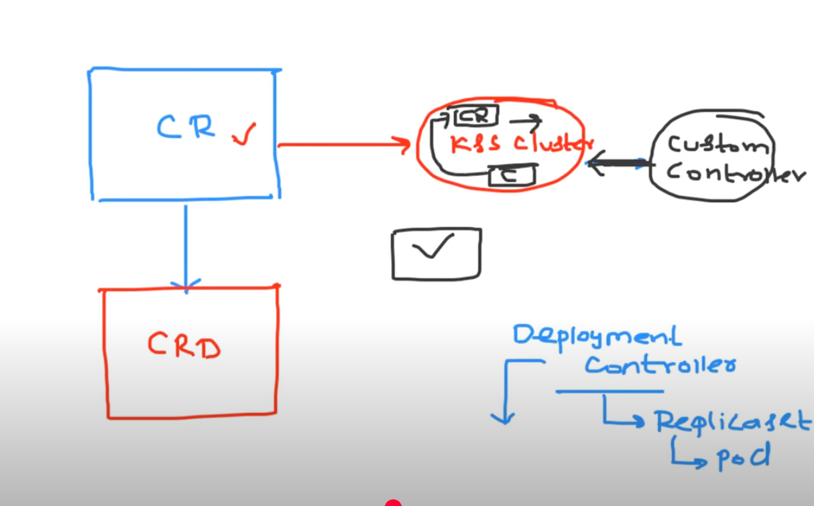
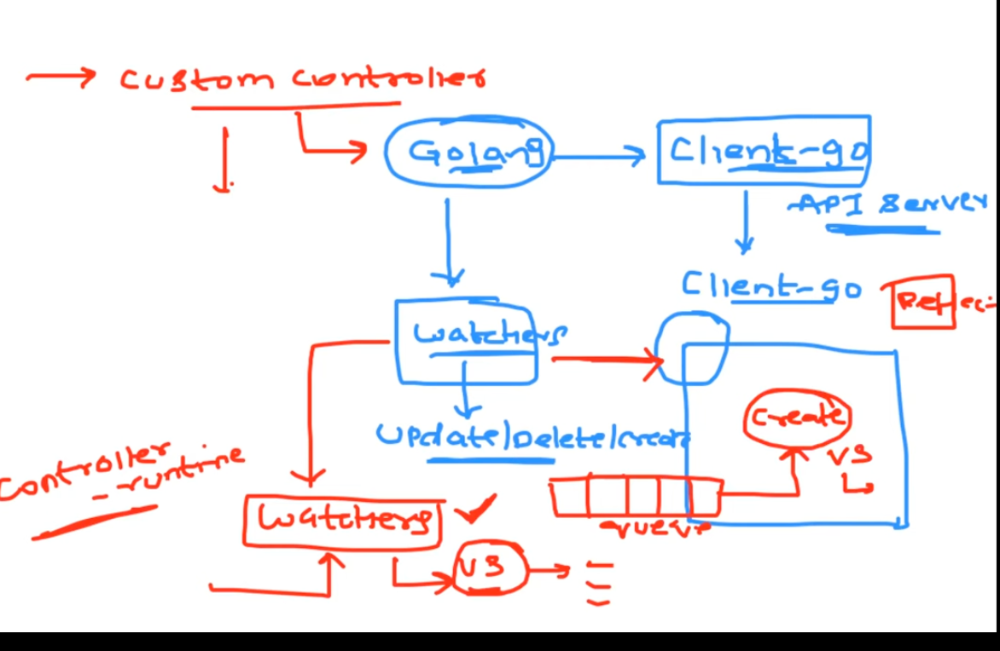
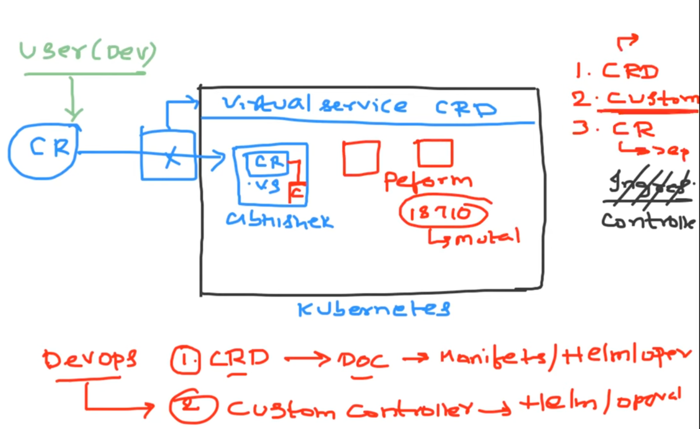

### **Extending Kubernetes with Custom Resources (CRDs), Custom Resources (CRs), and Controllers**

---

#### **1. Custom Resource Definition (CRD)**  
- **Purpose**: Extends Kubernetes API by defining new resource types (e.g., `VirtualService` for Istio).  
- **Deployment**:  
  - Created by DevOps engineers to register new resource schemas.  
  - Example CRD for Istio:  
    ```yaml  
    apiVersion: apiextensions.k8s.io/v1  
    kind: CustomResourceDefinition  
    metadata:  
      name: virtualservices.networking.istio.io  
    spec:  
      group: networking.istio.io  
      scope: Namespaced  
      names:  
        plural: virtualservices  
        singular: virtualservice  
        kind: VirtualService  
    ```  
- **Validation**: Kubernetes API server validates CRs against the CRD schema.  

---

#### **2. Custom Resource (CR)**  
- **Purpose**: An instance of a CRD (e.g., a specific `VirtualService` configuration).  
- **Deployment**:  
  - Created by users (developers/DevOps) in specific namespaces.  
  - Example CR for Istio:  
    ```yaml  
    apiVersion: networking.istio.io/v1alpha3  
    kind: VirtualService  
    metadata:  
      name: my-vs  
      namespace: john  
    spec:  
      hosts: ["my-app.com"]  
      http:  
        - route:  
            - destination:  
                host: my-app  
    ```  

---

#### **3. Custom Controller**  
- **Purpose**: Watches CRs and reconciles the cluster state (e.g., Istio controller applies service mesh rules).  
- **Deployment**:  
  - DevOps engineers deploy the controller (via Helm, manifests, or Operators).  
  - **Workflow**:  
    1. **Watch**: Monitors CRs (e.g., `VirtualService`) via Kubernetes API.  
    2. **Reconcile**: Compares desired state (CR) with actual state (cluster).  
    3. **Act**: Creates/updates/deletes resources (e.g., Envoy configurations).  

  
*Flow: User creates CR → Controller reconciles state → Desired resources are applied.*  

---

### **CRD vs. Helm vs. Operator**  
| **Feature**               | **CRD + Controller**          | **Helm**                          | **Operator**                      |  
|---------------------------|-------------------------------|-----------------------------------|-----------------------------------|  
| **Reconciliation**         | ✅ Custom logic (auto-heal)   | ❌ No auto-healing                | ✅ Built-in reconciliation         |  
| **Upgrades**               | Manual                        | Manual (re-deploy charts)         | ✅ Automatic (if policy enabled)  |  
| **Complexity**             | High (code required)          | Low (YAML templating)             | Medium (pre-built logic)          |  

---

### **Steps to Extend Kubernetes**  
1. **Deploy CRD**:  
   ```bash  
   kubectl apply -f virtualservice-crd.yaml  
   ```  
2. **Deploy Controller**:  
   ```bash  
   helm install istio-controller istio/istiod  
   ```  
3. **Create CR**:  
   ```bash  
   kubectl apply -f my-virtualservice.yaml -n john  
   ```  

---

### **How Controllers Work**  
1. **Watch**: Uses `client-go` and `reflector` to monitor CR events (create/update/delete).  
2. **Queue**: Events are added to a worker queue.  
3. **Reconcile**: Processes each event to align cluster state with CR spec.  

  
*Controller workflow: Watch → Queue → Reconcile.*  

---

### **Example: Istio Setup**  
1. **Deploy CRD**:  
   - From Istio docs:  
     ```bash  
     kubectl apply -f https://istio.io/v1.20/manifests/charts/base/crds/crd-all.yaml  
     ```  
2. **Deploy Controller**:  
   ```bash  
   helm install istiod istio/istiod  
   ```  
3. **User Creates CR**:  
   ```yaml  
   # my-virtualservice.yaml  
   apiVersion: networking.istio.io/v1alpha3  
   kind: VirtualService  
   metadata:  
     name: my-app-vs  
   spec:  
     hosts: ["my-app.com"]  
     http:  
       - route:  
           - destination:  
               host: my-app-svc  
   ```  

---

### **Tools for Building Controllers**  
- **Client Libraries**:  
  - **Go**: `client-go`, `controller-runtime` (used in Operators).  
  - **Python**: `kubernetes-client`.  
- **Frameworks**:  
  - **Operator SDK**: Simplifies building Operators (Go/Ansible/Helm).  
  - **Kubebuilder**: Scaffolds controller code.  

---

### **References**  
- [Kubernetes Sample Controller](https://github.com/kubernetes/sample-controller)  
- [Istio CRDs](https://istio.io/latest/docs/reference/config/)  
- [Operator Framework](https://operatorframework.io/)  

  
*Native vs. Custom Resources: Deployment (native) vs. VirtualService (custom).*  

By combining CRDs, CRs, and controllers, you extend Kubernetes to manage complex, application-specific workflows (e.g., service meshes, GitOps)