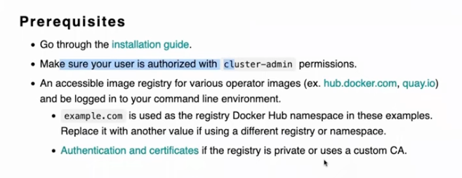
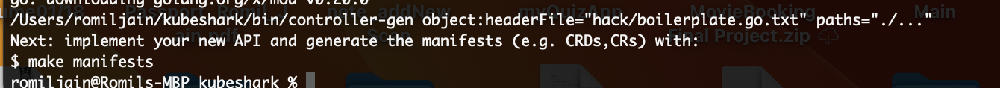
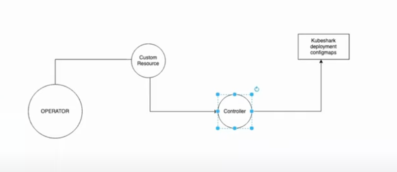

Controller

-  controller is something is used manage the state of particular kuberentes resource
sync between the expected and actual state
native kbernetes controller - replicaset(maintains the state of pos)
custom kubernetes controller - nginx, istio, argocd why do you write because to extend the capabalities of kubernetes cluster which are not provide by the kubernetes itself

Operators

- they are something that are used to bundle package and manage your kubernetes controller and most likely it deals with custom kbernetes controller

- example- istio operator - its purpose is to bundle the istio resource and to manage the istio resources that is isitio deployment, config maps, secrets all will be bundeled into a package and managed using kubernetes operators

- If i have k8s cluster and want to install istio kubernetes controller on k8s cluster, we can use yaml manifest or use helm charts and using operator

Difference between operators and helm charts
- Helm - chart.yaml, values.yaml, deployment, configmaps,....etc
- when install helm all will be replaced in the cluster
- but suppose someone updates the port in deployment with wrong port or someone messup with the secret, here helm does not have the capability to update the changes or fixing these changes or override these changes in kubernetes it is called reconciliations (Auto healing)
- helm charts cannot reconcile the changes or fix the things updated by someone

- whereas a Operators has a bundle that will be installed and it will created all the resources written in one of the language say go, 
- apart from bundling, packaging and managing it will also override any wrong changes
- whenever someone is writting an operator they also write the reconciliation logic which is resposible for auto fixing the modifcations, whoever write the operator is responsible to write the logic if the miss to write the logic then definitely operator will fail to fix the modificaiton

- now another features is lets say youu have a new version of istio like you are usinf a version x.y.1 for isitio but you have to change it to x.y.2 as it is critically important and you need to change it, so in this case it is your reponsibility you need to take the new version of helm and you need to deploy new version of the helmm chart only then your new version is picked up and your vulnerabilities are addressed whereas 
if using the operator if you enable the automatic sync or upgrade in the operator and if the upgrade policiy is present in the operator then what happens whenever there is a new version released then operator with automatically install the new version, operator handle the upgrade of your kubernetes controller which helm does not offer

- using one single operator you can create multiple instances of the controller example you can install istio controller in 100 namespaces or 1000 namespaces

- k8s operators offers you some telemetry inforamtion (which is nothing but who is using this kubernetes controller, how many people have installed the operator, are there any issues) there is an inbuitl telemetry system

How to write the operator
-  if we want to write a kubernetes operator - we can go to the operator framework portal
To write operators we can do it in 3 different ways
- Use Go language (will get all the features that operator supports, level 3, level 4 operators)
- Use Ansible (not get all the features, not get telemetry feature, level 1, level 2 operators)
- Use Helm (not get auto upgrades, level 1, level 2 operators)

- Prometheus can be used using prometheus operator a very popular operator
- Elastisearch operator
- ISTIO operator
- ArgoCD operator
- MinIO operator

- most of these operators are writtern in a framework called operator Sdk
- so operator framework sdk is a framework if you are using kubernetes operator
- so operator framework sdk provide with some bootstrap code in go basically they provide you steps to interact with client go, they create watchers automatically, they maintain the queue automatically when there multiple custom resouces

- inside the reconciliation logic I'll handle the 
    -> creation and 
    -> auto healing of our kubernetes,
    -> deletion

- where to store the operator -> operatorhub.io where you hace all the kubernetes operators, operatorhub.io only host the approved operators that means if you create your own operator you cannot put that operator bundle inside the operator hub.io unless the maintainer of operator hub.io approves your operator

- once you download the operator from operator hub.io now do you install it -> 
- example we have kubernetes cluster we will have to install a OLM (operator lifecycle manager)-> OLM will look for the operator bundle you have installed or downloaded and it will once again verify our download if we haven't donwloaded the corrrupted operator then it will create operator related resources ( whatrerver you have built in go language) for example deployment it is created in the operator lifecyle manager
- we can install the operators without the lifecycle manager, we don't need OLM to install the operators but it is a preferred way

Practical Representation

Steps to create an operator

- Go to operator framework website (https://operatorframework.io)
- Go to documentation but before this if we want to create an operator we need to have the controller like for which controller we are willing to write the operator
- Go to website operatorhub.io all operators are here (the approvers of the operator can be found on the github repo k8s-operatorhun/community-operators here we can push you operator for approval)
- To write a k8s operator look for the project that do not have operators 
- write k8s for kyverno or kubeshark or crossplane which don't have an operator
- now go tht operator framework and choose what type of operator we have to build a go based operator or ansible based or a helm-based operator
- go with develop with go and here we need to start with bootstrapping
- next go with the prerequisites section - you need go, docker, kubectl, git

Step 1: now create a folder called 
- command: mkdir kubershark

Step 2: cd to the folder
- command: cd kubeshark

Step 3: 
- command: operator-sdk init --domain ""   --repo github.com/Romilj012/kubeshark-operator 
go project created

Step 4:
- open it in vscode and notice that the operator sdk has initialised a lot of things for us 

to write a kubernetes controller you have to use a controller runtime package because using this package it helps in boostrapping lot of code for us

Step 5:
- create the api for or operator
- command: operator-sdk create api --group kubershark.example.io --version v1alpha1 --kind KubesharkOperator --resource --controller

for every resource in kubernetes you need to have an api group, kind and api version 
even for the operator it creates resources, controller for us to create we have to submit a custom resource that you want the user to submit to interact with that 
to decide the group keep it as relevant as possible for your project .
now after executing the above command we will notice that it has created a lot of additional thing for you and this is where the operator will create all the required code that will interact with the client go for you 

the command has created a new folder named api and it has files named groupversions_info.go, Kubesharkoperator_types.go, zz_generated.deepcopy.go

Step 6:
- Next Implement your new API and generate the manifests (e.g. CRDs,CRs) with: $ make manifests
and write the reconciliation logic

Flow Digram

- We are creating an operator and our end goal through operator is to create a controller and want to manage the controller
- how will operator know that we are looking for a controller for that we need to use a trigger it can create a controller for a us.
and what is the trigger it is a custom resource
- so the user will submit a custom resource to the operator and the operator will read the custom resource and creates the controller
- now in go you need to define this custom resource  
- now we have to understand what all resources the kubeshark project will require, do we need kubeshark deployment, configmap
- now using the CRD we wil try to populate all teh resources
- now to write the controller specific code go to the controller folder and under it go to kubesharkoperator_controller.go