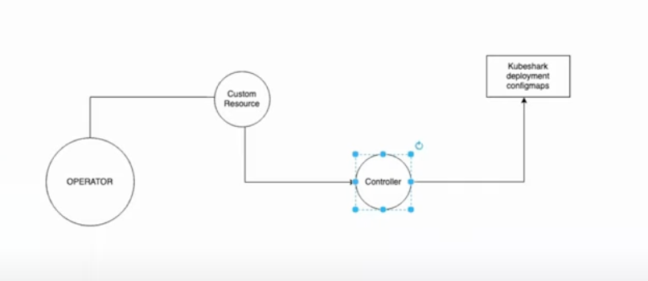

---
## Operators
### Kubernetes Controllers vs. Operators  
**Controllers**:  
- **Purpose**: Manage the state of Kubernetes resources (e.g., ReplicaSet ensures pod replicas match desired state).  
- **Native Controllers**: Built-in (e.g., ReplicaSet, Deployment).  
- **Custom Controllers**: Extend Kubernetes capabilities (e.g., Istio, ArgoCD).  

**Operators**:  
- **Definition**: Bundle and manage custom controllers, including reconciliation logic (auto-healing) and lifecycle management.  
- **Key Features**:  
  - **Auto-healing**: Fix misconfigurations (e.g., reverting a port change in a deployment).  
  - **Upgrades**: Automatically apply new versions if upgrade policies are defined.  
  - **Multi-instance Management**: Deploy controllers across multiple namespaces.  
  - **Telemetry**: Monitor usage/health (e.g., Prometheus Operator).  

---

### **Operators vs. Helm Charts**  
| **Feature**               | **Helm**                          | **Operator**                          |  
|---------------------------|-----------------------------------|---------------------------------------|  
| **Reconciliation**         | ❌ No auto-healing                | ✅ Auto-healing via reconciliation    |  
| **Upgrades**               | Manual (re-deploy charts)         | ✅ Automatic (if policy enabled)      |  
| **Multi-instance Support** | Limited                           | ✅ Scalable (e.g., 1000 namespaces)   |  
| **Telemetry**              | ❌                                | ✅ Built-in monitoring                 |  

---

### **How to Build an Operator**  
**Prerequisites**:  
- Go, Docker, kubectl, Git.  

**Steps**:  
1. **Initialize Project**:  
   ```bash  
   mkdir kubeshark-operator && cd kubeshark-operator  
   operator-sdk init --domain example.io --repo github.com/yourname/kubeshark-operator  
   ```  

2. **Create API/CRD**:  
   ```bash  
   operator-sdk create api --group kubeshark --version v1alpha1 --kind KubesharkOperator --resource --controller  
   ```  
   - Generates boilerplate code in `api/` and `controllers/`.  

3. **Define Custom Resource (CR)**:  
   - Edit `api/v1alpha1/kubesharkoperator_types.go` to define spec/status fields.  

4. **Reconciliation Logic**:  
   - Implement logic in `controllers/kubesharkoperator_controller.go`:  
     ```go  
     func (r *KubesharkOperatorReconciler) Reconcile(ctx context.Context, req ctrl.Request) (ctrl.Result, error) {  
       // 1. Fetch CR instance  
       // 2. Create/Update resources (Deployments, ConfigMaps)  
       // 3. Handle errors/retries  
     }  
     ```  

5. **Generate Manifests**:  
   ```bash  
   make manifests  # Generates CRDs in `config/crd/`.  
   ```  

6. **Deploy Operator**:  
   ```bash  
   make install    # Install CRDs  
   make docker-build && make deploy  # Build and deploy operator  
   ```  

---

### **Operator Workflow**  
1. **User Submits CR**:  
   ```yaml  
   apiVersion: kubeshark.example.io/v1alpha1  
   kind: KubesharkOperator  
   metadata:  
     name: kubeshark-instance  
   spec:  
     replicas: 3  
   ```  
2. **Operator Triggers**:  
   - Watches for CR changes and invokes `Reconcile()`.  
3. **Reconciliation Loop**:  
   - Creates resources (Deployments, Services).  
   - Auto-heals misconfigurations.  
   - Manages upgrades/deletions.  

---

### **Popular Operators**  
- **Istio Operator**: Manages service mesh components.  
- **Prometheus Operator**: Deploys monitoring stack.  
- **ArgoCD Operator**: Handles GitOps workflows.  

### **Operator Distribution**  
- **OperatorHub.io**: Hosts approved operators (e.g., Elasticsearch, MinIO).  
- **OLM (Operator Lifecycle Manager)**: Manages operator installation/upgrades.  

  
*Flow: User submits CR → Operator reconciles state → Desired resources are created.*  

By using operators, you automate complex workflows, reduce manual intervention, and ensure consistency in Kubernetes environments.