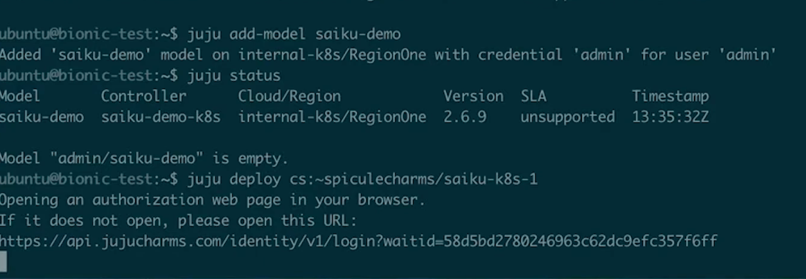
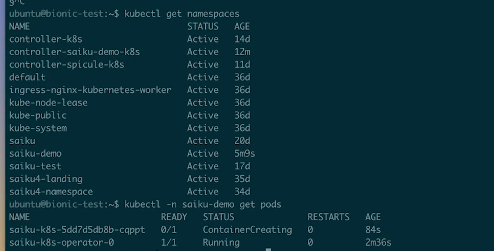

---

### **Juju & Charms: Simplifying Kubernetes Application Management**

---

#### **1. Juju**  
- **Purpose**: Simplifies deployment and management of complex applications across clouds and Kubernetes through reusable components (Charms).  
- **Key Features**:  
  - CLI-driven operations  
  - Multi-cloud/Kubernetes support  
  - Relationship management between services  

```bash
# Core Juju Commands
juju bootstrap kubernetes  # Initialize control plane
juju deploy wordpress-k8s  # Deploy application
juju relate app1 app2      # Connect services
```

---

#### **2. Charms**  
- **Purpose**: Pre-built operators containing application deployment logic and lifecycle management.  
- **Structure**:  
  ```yaml
  name: mysql-k8s
  summary: MySQL for Kubernetes
  requires:
    database: mysql
  provides:
    endpoint: tcp
  ```  
- **Components**:  
  1. **Metadata**: Name, maintainer, description  
  2. **Relations**: Service dependencies  
  3. **Layers**: Kubernetes manifests (`layer.yaml`)  

  
*Charm components: Metadata, relations, and Kubernetes layers.*

---

### **Deployment Workflow**  

#### **1. Bootstrap Cluster**  
```bash
juju bootstrap kubernetes
juju add-model web-app
```

#### **2. Deploy Applications**  
```bash
juju deploy wordpress-k8s
juju deploy mysql-k8s
juju relate wordpress-k8s mysql-k8s
```

#### **3. Verify Deployment**  
```bash
watch --color juju status --color  # Real-time status
juju debug-log -f                  # Stream logs
```

  
*Flow: Bootstrap → Deploy → Relate → Monitor.*

---

### **Juju vs Helm vs Operators**  
| **Feature**         | **Juju**                        | **Helm**                     | **Operator**                |  
|---------------------|---------------------------------|------------------------------|-----------------------------|  
| **Packaging**       | Charms (with lifecycle mgmt)   | Charts (templated YAML)      | Custom Controllers          |  
| **Relationships**   | ✅ Native support              | ❌ Manual configuration      | ✅ Custom logic             |  
| **Upgrades**        | ✅ Automatic                   | ❌ Manual re-deploy          | ✅ Version-aware            |  
| **Complexity**      | Medium                         | Low                          | High                        |  

---

### **Advanced Operations**  

#### **1. Scaling Applications**  
```bash
juju add-unit wordpress-k8s --num-units 3
```

#### **2. Managing Dependencies**  
```bash
juju relate mariadb-k8s saiku-k8s
juju remove-relation mysql wordpress
```

#### **3. Upgrading Components**  
```bash
juju refresh wordpress-k8s --channel=beta
```

---

### **Troubleshooting**  

| **Issue**              | **Diagnosis**                     | **Solution**                     |  
|------------------------|-----------------------------------|----------------------------------|  
| Deployment stuck       | `juju status` shows blocked       | Check relations with `juju debug-log` |  
| juju-images/Image pull errors      | `juju debug-log` shows auth error | Verify container registry creds  |  
| API connection issues  | `juju status` connection refused  | Verify Kubernetes cluster status |  

```bash
juju ssh wordpress/0          # Access container shell
juju show-application mysql   # Inspect app config
```

---

### **Charm Development**  

#### **1. Create New Charm**  
```bash
charm create my-charm
```

#### **2. Build & Deploy**  
```bash
charm build
charm push ./build/ my-charm
juju deploy my-charm --channel=edge
```

#### **3. Kubernetes Integration**  
```yaml
# layer.yaml
includes: ["layer:kubernetes"]
```

---

### **References**  
- [Official Juju Documentation](https://juju.is/docs)  
- [Charmhub Registry](https://charmhub.io)  
- [Kubernetes Charm Examples](https://github.com/canonical/charm-kubernetes)  

  
*Juju components: Controller, models, and deployed applications.*

---

By combining Juju's application modeling with Kubernetes-native Charms, teams can manage complex distributed systems while maintaining operational consistency across environments.
