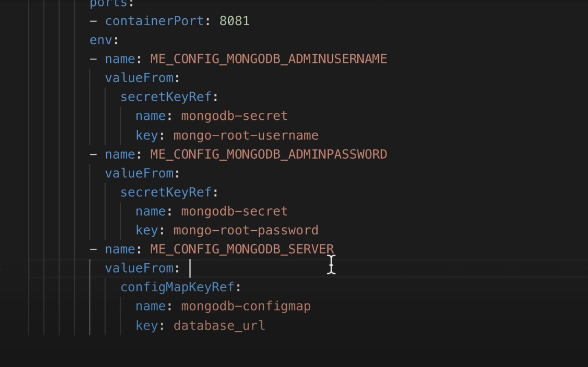

---

# Deploying MongoDB and Express Applications in Kubernetes

In this guide, we will deploy two applications, MongoDB and Express, to demonstrate a typical setup of a web application and its database. This setup can be applied to any similar application architecture.

## Overview

1. **MongoDB Deployment**: We will create a MongoDB pod and an internal service to allow communication within the cluster.
2. **Express Deployment**: We will create an Express deployment that connects to MongoDB using a ConfigMap and Secret for configuration.
3. **External Service**: We will create an external service to allow access to the Express application from a browser.

  
*Diagram of the application setup.*

---

## Step 1: MongoDB Deployment

### Create MongoDB Deployment

We will start by creating a MongoDB deployment. The deployment will include a pod and an internal service.

```yaml
apiVersion: apps/v1
kind: Deployment
metadata:
  name: mongodb-deployment
  labels:
    app: mongodb
spec:
  replicas: 1
  selector:
    matchLabels:
      app: mongodb
  template:
    metadata:
      labels:
        app: mongodb
    spec:
      containers:
      - name: mongodb
        image: mongo
        ports:
        - containerPort: 27017
        env:
        - name: MONGO_INITDB_ROOT_USERNAME
          valueFrom:
            secretKeyRef:
              name: mongodb-secret
              key: mongo-root-username
        - name: MONGO_INITDB_ROOT_PASSWORD
          valueFrom: 
            secretKeyRef:
              name: mongodb-secret
              key: mongo-root-password
```

  
*MongoDB deployment configuration in Visual Studio Code.*

---

### Create Secret for MongoDB Credentials

We will create a secret to store the MongoDB credentials securely.

```yaml
apiVersion: v1
kind: Secret
metadata:
  name: mongodb-secret
type: Opaque
data:
  mongo-root-username: dXNlcm5hbWU=
  mongo-root-password: cGFzc3dvcmQ=
```

  
*Creating a secret in the terminal.*

  
*Secret configuration file.*

---

### Apply the Secret and Deployment

1. Apply the secret:
   ```bash
   kubectl apply -f mongodb-secret.yaml
   ```
2. Apply the deployment:
   ```bash
   kubectl apply -f mongodb-deployment.yaml
   ```

  
*Applying the secret using `kubectl`.*

  
*Verifying the secret creation.*

---

### Verify the Deployment

Check the status of the pod:
```bash
kubectl get pods
```

  
*Checking the status of the MongoDB pod.*

---

## Step 2: Create Internal Service for MongoDB

We will create an internal service to allow other components in the cluster to communicate with MongoDB.

```yaml
apiVersion: v1
kind: Service
metadata:
  name: mongodb-service
spec:
  selector:
    app: mongodb
  ports:
    - protocol: TCP
      port: 27017
      targetPort: 27017
```

  
*Internal service configuration.*

---

### Apply the Service

```bash
kubectl apply -f mongodb-service.yaml
```

  
*Applying the internal service.*

---

### Verify the Service

Check the service status:
```bash
kubectl get services
```

  
*Verifying the internal service.*

---

## Step 3: Express Deployment and ConfigMap

### Create ConfigMap for MongoDB URL

We will create a ConfigMap to store the MongoDB URL.

```yaml
apiVersion: v1
kind: ConfigMap
metadata:
  name: mongodb-configmap
data:
  database_url: mongodb-service
```

  
*ConfigMap configuration.*

---

### Create Express Deployment

The Express deployment will reference the ConfigMap and Secret for configuration.

```yaml
apiVersion: apps/v1
kind: Deployment
metadata:
  name: mongo-express
  labels:
    app: mongo-express
spec:
  replicas: 1
  selector:
    matchLabels:
      app: mongo-express
  template:
    metadata:
      labels:
        app: mongo-express
    spec:
      containers:
      - name: mongo-express
        image: mongo-express
        ports:
        - containerPort: 8081
        env:
        - name: ME_CONFIG_MONGODB_ADMINUSERNAME
          valueFrom:
            secretKeyRef:
              name: mongodb-secret
              key: mongo-root-username
        - name: ME_CONFIG_MONGODB_ADMINPASSWORD
          valueFrom: 
            secretKeyRef:
              name: mongodb-secret
              key: mongo-root-password
        - name: ME_CONFIG_MONGODB_SERVER
          valueFrom: 
            configMapKeyRef:
              name: mongodb-configmap
              key: database_url
```

  
*Express deployment configuration.*

---

### Apply the ConfigMap and Deployment

1. Apply the ConfigMap:
   ```bash
   kubectl apply -f mongodb-configmap.yaml
   ```
2. Apply the deployment:
   ```bash
   kubectl apply -f mongo-express-deployment.yaml
   ```

  
*Applying the ConfigMap and deployment.*

---

### Verify the Deployment

Check the status of the pod:
```bash
kubectl get pods
```

  
*Verifying the Express pod.*

---

## Step 4: Create External Service for Express

We will create an external service to allow access to the Express application from a browser.

```yaml
apiVersion: v1
kind: Service
metadata:
  name: mongo-express-service
spec:
  selector:
    app: mongo-express
  type: LoadBalancer  
  ports:
    - protocol: TCP
      port: 8081
      targetPort: 8081
      nodePort: 30000
```

  
*External service configuration.*

---

### Apply the Service

```bash
kubectl apply -f mongo-express-service.yaml
```

  
*Applying the external service.*

---

### Verify the Service

Check the service status:
```bash
kubectl get services
```

  
*Verifying the external service.*

---

### Access the Express Application

To access the Express application, use the external IP and port:
```bash
minikube service mongo-express-service
```

  
*Accessing the Express application in the browser.*

---

## Summary

1. **MongoDB Deployment**: Created a MongoDB deployment and internal service.
2. **Express Deployment**: Created an Express deployment that connects to MongoDB using a ConfigMap and Secret.
3. **External Service**: Created an external service to allow access to the Express application from a browser.

This setup demonstrates how to deploy a web application and its database in Kubernetes, with secure configuration and external access.

---

### Final Diagram

  
*Final request flow diagram.*

---

